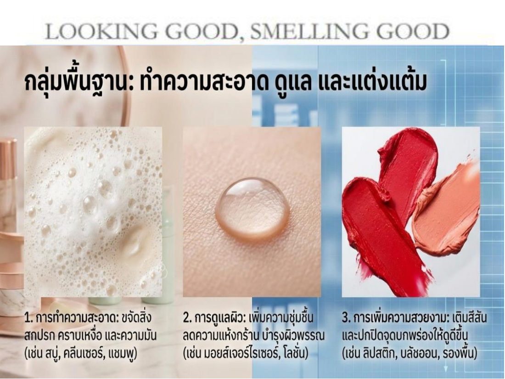
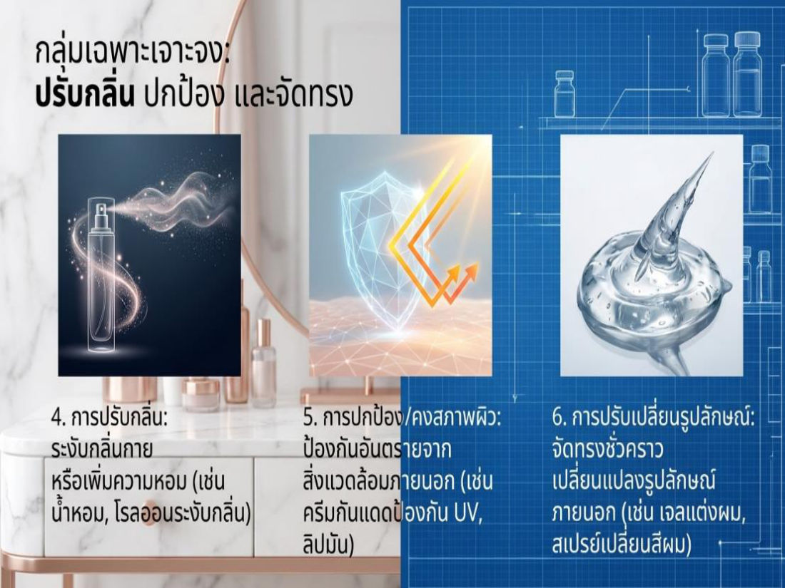
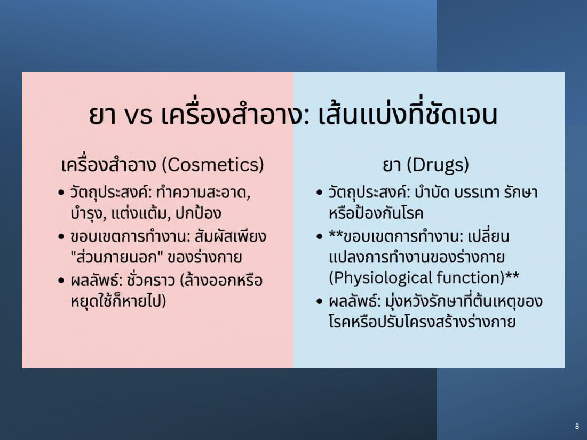
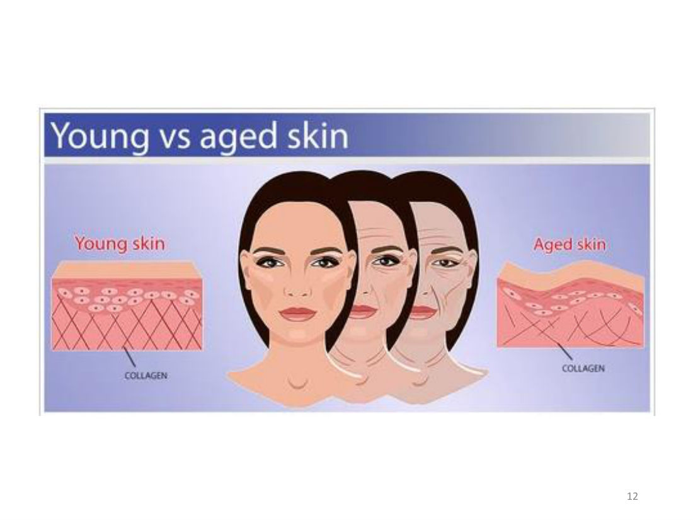
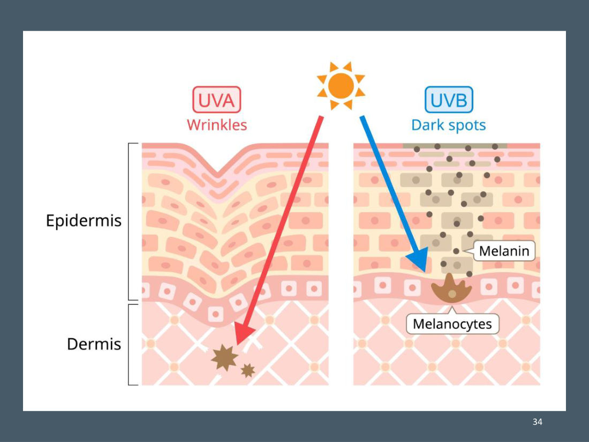
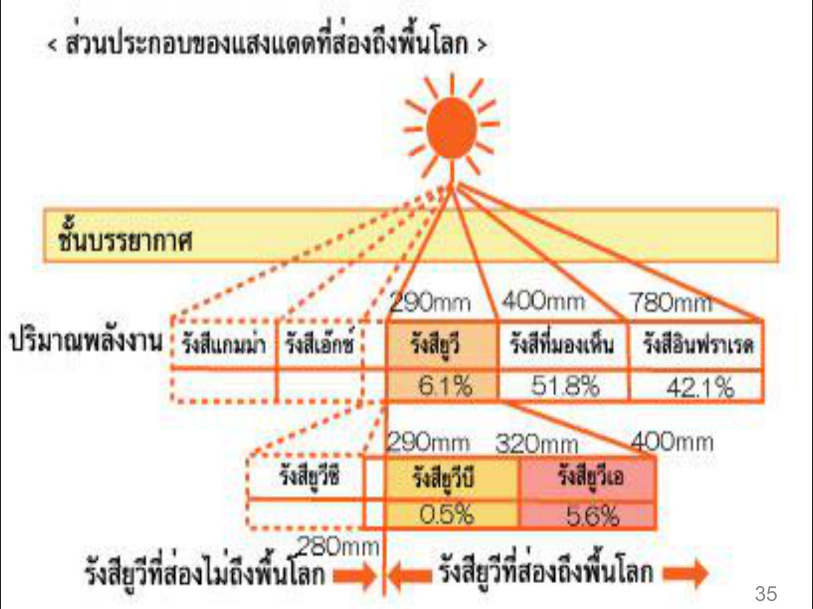

# สรุป: บทที่ 5 เครื่องสำอาง (GE110 วิทยาศาสตร์และเทคโนโลยีในชีวิตประจำวัน)

> บทนี้เรียนว่า "เครื่องสำอาง" ตามกฎหมายคืออะไร ต่างจากยาอย่างไร แบ่งกี่ประเภท ผิวหนังมีกี่ชั้น รังสี UV ทำอะไรกับผิว สารแต่ละตัวในเครื่องสำอางทำหน้าที่อะไร และสารห้ามใช้อันตรายอย่างไร
> ในข้อสอบฝึก บทนี้ออก **18 ข้อ** (ข้อ 1–18) เน้น: นิยาม, 3 ประเภทตาม พ.ร.บ., ชั้นผิว, UVA/UVB/UVC, SPF, สารทำให้ผิวขาว, สารห้ามใช้ 4 ตัว

## สารบัญ
1. เครื่องสำอางคืออะไร / หน้าที่ 6 ข้อ
2. ผลิตภัณฑ์ที่ **ไม่ใช่** เครื่องสำอาง (ยา vs เครื่องสำอาง)
3. ผิวหนัง 3 ชั้น
4. การเสื่อมสภาพของผิว (skin aging)
5. รังสี UV 3 ชนิด
6. ความหมายตาม พ.ร.บ.เครื่องสำอาง พ.ศ. 2535
7. ประเภทของเครื่องสำอาง 3 ประเภท
8. ส่วนประกอบและหน้าที่ของสารในเครื่องสำอาง
9. สารกันแดด / SPF / การเลือกใช้
10. สารทำให้ผิวขาว และ AHA
11. สารห้ามใช้ และอันตราย
12. สาเหตุอาการข้างเคียง
13. ข้อแนะนำการเลือกซื้อและใช้

---

## 1. เครื่องสำอางคืออะไร

**แนวคิดเปิดบท:** สุขภาพกายและใจที่สมบูรณ์ ส่งผลต่ออารมณ์และความสมดุลของร่างกาย แล้ว "สะท้อนออกมา" เป็นผิวพรรณที่สดใส เปล่งปลั่ง

**เครื่องสำอาง** = ผลิตภัณฑ์ที่ใช้ **เฉพาะกับผิวภายนอกเท่านั้น** เช่น ผิวหนัง ริมฝีปาก ในช่องปาก เส้นผม เล็บ และอวัยวะเพศส่วนนอก
- ใช้ปรับแต่งให้ดูดี โดย **ไม่มีผลต่อโครงสร้างหรือการทำหน้าที่ของร่างกาย**
- ใช้ระงับกลิ่นกาย แต่งกลิ่นหอม
- ใช้ทำความสะอาดในชีวิตประจำวัน เช่น ขจัดเหงื่อไคล สิ่งสกปรก

**หน้าที่ของเครื่องสำอาง 6 กลุ่ม** ("Looking good, smelling good")

| กลุ่ม | หน้าที่ | ตัวอย่าง |
|---|---|---|
| พื้นฐาน | 1. ทำความสะอาด — ขจัดสิ่งสกปรก คราบเหงื่อ ความมัน | สบู่ คลีนเซอร์ แชมพู |
| พื้นฐาน | 2. ดูแลผิว — เพิ่มความชุ่มชื้น ลดความแห้ง บำรุง | มอยส์เจอไรเซอร์ โลชั่น |
| พื้นฐาน | 3. เพิ่มความสวยงาม — เติมสีสัน ปกปิดจุดบกพร่อง | ลิปสติก บลัชออน รองพื้น |
| เฉพาะเจาะจง | 4. ปรับกลิ่น — ระงับกลิ่นกาย เพิ่มความหอม | น้ำหอม โรลออน |
| เฉพาะเจาะจง | 5. ปกป้อง/คงสภาพผิว — ป้องกันอันตรายจากภายนอก | ครีมกันแดด ลิปมัน |
| เฉพาะเจาะจง | 6. ปรับเปลี่ยนรูปลักษณ์ชั่วคราว | เจลแต่งผม สเปรย์เปลี่ยนสีผม |

## 2. ผลิตภัณฑ์ที่ "มิใช่" เครื่องสำอาง

ถ้าผลิตภัณฑ์ทำอย่างใดอย่างหนึ่งนี้ → **ไม่ใช่เครื่องสำอาง** (เป็นยา/หัตถการ):
- ใช้ **ป้องกัน บำบัด บรรเทา รักษาโรค**
- **มีผลต่อโครงสร้าง หรือการทำหน้าที่ของร่างกาย** (ตัวอย่างในสไลด์: ฉีดฟิลเลอร์, ฉีดโบท็อกซ์)

> **"เครื่องสำอาง ไม่ใช่ ยา" (Cosmetics are not drugs)** — ไม่ว่าแบรนด์จะใช้คำว่า Cosmeceuticals หรือมีสารออกฤทธิ์ (Active Ingredients) เข้มข้นแค่ไหน ตามกฎหมายและชีววิทยา เครื่องสำอางทำหน้าที่แทนยาไม่ได้

| | เครื่องสำอาง (Cosmetics) | ยา (Drugs) |
|---|---|---|
| วัตถุประสงค์ | ทำความสะอาด บำรุง แต่งแต้ม ปกป้อง | บำบัด บรรเทา รักษา หรือป้องกันโรค |
| ขอบเขตการทำงาน | สัมผัสเพียง **ส่วนภายนอก** ของร่างกาย | **เปลี่ยนแปลงการทำงานของร่างกาย** (physiological function) |
| ผลลัพธ์ | **ชั่วคราว** — ล้างออกหรือหยุดใช้ก็หายไป | มุ่งรักษาที่ต้นเหตุของโรค หรือปรับโครงสร้างร่างกาย |

> ⚠️ มักออกสอบ: ตัวเลือกที่มีคำว่า "รักษาโรค" หรือ "มีผลต่อโครงสร้าง/การทำหน้าที่ของร่างกาย" = **ไม่ใช่เครื่องสำอาง**

## 3. ผิวหนัง (skin) 3 ชั้น

หน้าที่หลักของผิวหนัง: **ป้องกันสิ่งรบกวนจากภายนอก และคุ้มครองอวัยวะภายใน**

| ชั้น | ประกอบด้วย / ลักษณะ | จุดที่ต้องจำ |
|---|---|---|
| **1. หนังกำพร้า** (หนังชั้นนอก) | ปกคลุมด้วยเหงื่อและไขมันจากต่อมไขมัน/ต่อมเหงื่อ มีสภาพ **เป็นกรดอ่อน ๆ** | กรดอ่อน ๆ ช่วย **ต้านทานเชื้อโรค** — ถ้าผิวเริ่มเป็น **ด่าง** เชื้อโรคจะแพร่ง่ายขึ้น ภูมิต้านทานผิวลดลง |
| **2. หนังแท้** (หนังชั้นใน) | เส้นเลือด ต่อมไขมัน ต่อมเหงื่อ ต่อมน้ำเหลือง รากขน ทางผ่านเส้นประสาท มี **น้ำ** เป็นส่วนประกอบมาก | **คอลลาเจน (collagen)** เป็นส่วนประกอบใหญ่ = เส้นใยโปรตีนเรียงขนาน รักษาสมดุลแรงยืดกล้ามเนื้อ ถ้าน้ำลดลงหรือคอลลาเจนเสื่อม → เกิด **ฝ้า** |
| **3. ชั้นใต้ผิวหนัง** | ไฟเบอร์ (fiber) + ไขมัน (เรียก "ไขมันชั้นใต้ผิวหนัง") | สร้าง **ส่วนโค้งเว้า** ของร่างกาย + เป็น **หมอนรองรับแรงกระเทือน** ต่อกระดูก กล้ามเนื้อ เส้นเอ็น เมื่อขาดอาหาร ไขมันจะเปลี่ยนเป็นสารอาหารเข้ากระแสเลือด ปริมาณเปลี่ยนตามวัยและฤดูกาล |

> 💡 จำง่าย: **กำพร้า = กรด** (กันเชื้อ) · **แท้ = คอลลาเจน** (ความยืดหยุ่น) · **ใต้ผิว = ไขมัน** (หมอน + ส่วนโค้ง)

## 4. การเสื่อมสภาพของผิว (skin aging)

| ชนิด | สาเหตุ | แก้ไขได้ไหม |
|---|---|---|
| **ปัจจัยภายใน** (endogenous skin aging) | **พันธุกรรม** เหมือนอวัยวะอื่น ๆ | แก้ไขไม่ได้ |
| **จากแสงแดด** (**photoaging**) | **แสงแดด** ทำให้ผิว **ดูแก่ก่อนวัย** ต่างจากผิวเสื่อมตามธรรมชาติอย่างเด่นชัด | เพราะ **ร่างกายซ่อมแซมไม่ได้** → ต้องป้องกัน |

## 5. รังสี UV 3 ชนิด (แบ่งตามความยาวคลื่น)

รังสี UV = คลื่นความถี่สั้น **พลังงานมากที่สุด** ในบรรดารังสีจากดวงอาทิตย์ที่ถึงพื้นโลก UVA และ UVB ส่องถึงพื้นโลกได้ และมีแนวโน้มเพิ่มขึ้นเพราะชั้นบรรยากาศถูกทำลาย

| รังสี | ลักษณะ | ผลต่อผิว |
|---|---|---|
| **UVA** | คลื่น **ยาว** พลังงาน **ต่ำ** พบในชีวิตประจำวัน **ลอดผ่านกระจกและเมฆ** เข้าถึงชั้นผิวลึก | ผิว **สีแทน**/คล้ำแดง, **เร่งการชราภาพ (aging)**, **รอยเหี่ยวย่น** ผิวหย่อนยาน, เพิ่มความเสี่ยงมะเร็งผิวหนังและ **ต้อกระจก** |
| **UVB** | คลื่น **สั้น** พลังงาน **สูง** พบมากในที่เที่ยวกลางแจ้ง | ผิว **ไหม้** บวมแดง คล้ำแดด, **ทำลาย DNA** ของเซลล์ผิว → **มะเร็งผิวหนัง** หลายชนิด |
| **UVC** | **ถูกชั้นบรรยากาศกรอง** ส่องถึงพื้นโลกน้อยมาก | ไม่มีผลมากนัก |

> 💡 จำ: **A = Aging** (แก่ เหี่ยว แทน) · **B = Burn** (ไหม้ มะเร็ง ทำลาย DNA) · **C = Cut off** (บรรยากาศกรองไว้)

**ส่วนประกอบแสงแดดที่ถึงพื้นโลก:** รังสียูวี 6.1% · แสงที่มองเห็น 51.8% · อินฟราเรด 42.1% (ในส่วนยูวี: UVB 0.5%, UVA 5.6%; UVC < 280 nm ส่องไม่ถึงพื้นโลก)

## 6. ความหมายตาม พ.ร.บ.เครื่องสำอาง พ.ศ. 2535 (มาตรา 4)

1. วัตถุที่มุ่งหมายใช้ **ทา ถู นวด โรย พ่น หยอด ใส่ อบ** หรือวิธีอื่นต่อส่วนของร่างกาย เพื่อ **ความสะอาด ความสวยงาม** หรือส่งเสริมความสวยงาม รวมเครื่องประทินผิว — **แต่ไม่รวมเครื่องประดับและเครื่องแต่งตัว** ที่เป็นอุปกรณ์ภายนอกร่างกาย
2. วัตถุที่ใช้เป็น **ส่วนผสมในการผลิตเครื่องสำอาง** โดยเฉพาะ
3. วัตถุอื่นที่ **กฎกระทรวง** กำหนดให้เป็นเครื่องสำอาง

**สรุปคุณสมบัติเครื่องสำอาง 4 ข้อ:** (1) ใช้เฉพาะผิวกายภายนอก (2) ใช้ทำความสะอาด (3) ระงับกลิ่นกาย แต่งกลิ่นหอม (4) ปกป้อง/ส่งเสริมสุขภาพดี ปรับแต่งให้ดูดี **โดยไม่มีผลต่อโครงสร้างหรือการทำหน้าที่ของร่างกาย**

## 7. ประเภทของเครื่องสำอาง (พ.ร.บ. 2535) — 3 ประเภท

| ประเภท | ความเสี่ยง / การควบคุม | ตัวอย่าง |
|---|---|---|
| **1. ควบคุมพิเศษ** | เสี่ยง **สูงสุด** (เคมีในส่วนผสมมีพิษภัย) ควบคุมเข้มงวดที่สุด **ต้องขึ้นทะเบียนตำรับ** | **ยาสีฟัน, น้ำยาบ้วนปาก, น้ำยาย้อมผม, น้ำยาฟอกสีผม, น้ำยาทำให้ผมดำ** |
| **2. ควบคุม** | เสี่ยงบ้าง แต่น้อยกว่าควบคุมพิเศษ | ดูตารางย่อยด้านล่าง |
| **3. ทั่วไป** | ไม่มีสารควบคุมพิเศษหรือสารควบคุม | แชมพู/ครีมนวดที่ **ไม่มีสารขจัดรังแค**, โลชั่น, ครีมบำรุง, อายแชโดว์, อายไลเนอร์, ดินสอเขียนคิ้ว, บลัชออน, **ลิปสติก, ครีมรองพื้น**, แป้งทาหน้า, **สบู่ก้อน**, สบู่เหลว, โฟม, น้ำมันทาผิว, ระงับกลิ่นกาย, สีทาเล็บ, มูส/เจลแต่งผม |

**เครื่องสำอางควบคุม แบ่ง 2 แบบ**
- **2.1 กำหนดตามชนิดผลิตภัณฑ์ 4 ประเภท:** (1) **ผ้าอนามัย** ทั้งแผ่นและแบบสอด (2) **ผ้าเย็น/กระดาษเย็นในภาชนะปิด** (3) **แป้งฝุ่นโรยตัว** (4) **แป้งน้ำ**
- **2.2 กำหนดตามสารควบคุม** (มีสารเหล่านี้ = ควบคุม): (1) **สารป้องกันแสงแดด 19 ชนิด** ตามบัญชีแนบท้ายประกาศกระทรวงสาธารณสุข (2) สารขจัดรังแค **ซิงก์ไพริไทโอน และไพรอกโทนโอลามีน** (3) สารขจัดรังแค **คลิมบาโซล**

> ⚠️ กับดักที่พบบ่อย: **ยาสีฟัน = ควบคุมพิเศษ** (ไม่ใช่ควบคุม) · **แป้งฝุ่นโรยตัว/ผ้าอนามัย = ควบคุม** · **ลิปสติก/สบู่ก้อน = ทั่วไป** · แชมพู "มีสารขจัดรังแค" = ควบคุม แต่ "ไม่มี" = ทั่วไป

## 8. ส่วนประกอบและหน้าที่ในผลิตภัณฑ์เครื่องสำอาง

**สารสำคัญ (Active Ingredient)** = สารออกฤทธิ์ที่ทำให้เกิดสรรพคุณ ได้แก่ (1) สารควบคุมพิเศษ ในเครื่องสำอางควบคุมพิเศษ (2) สารควบคุม ในเครื่องสำอางควบคุม (3) สารส่วนประกอบสำคัญที่แจ้งชื่อและปริมาณไว้ต่อเจ้าหน้าที่ หรือระบุบนฉลาก

| สาร | หน้าที่ / คุณสมบัติ |
|---|---|
| **Emollient** (สารหล่อลื่น ให้ความชุ่มชื้น) | เป็น **ฟิล์มเคลือบผิว** เก็บน้ำไว้กับผิว (**ป้องกันน้ำออก**) · คือน้ำมันทั้งหลาย ทั้งสังเคราะห์และธรรมชาติ |
| **Silicone-based Oil** | คล้ายน้ำมันทั่วไป · คุณสมบัติเหมือน Emollient **แต่เกิดจากการสังเคราะห์** |
| **Astringent** (สารฝาดสมาน) | **ตกตะกอนโปรตีน** ช่วยชำระโปรตีนและสิ่งระคายเคืองออก · ผิวสดชื่น ลดระคายเคือง ช่วยสมานแผลเล็ก ๆ · รู้สึก **กระชับ ตึง** |
| **Exfoliants** (สารทำให้เกิดการลอก) = **AHA, BHA** | กรดอ่อน ๆ ทำให้เซลล์ผิวชั้นนอก **ยุ่ย อ่อนตัว หลุดลอก** กระตุ้นผิวใหม่ · ดึงน้ำไว้กับผิว จึงให้ความชุ่มชื้นได้ |
| **Preservatives** (สารกันเสีย) | ลดการเจริญเติบโตของแบคทีเรียที่ทำให้ผลิตภัณฑ์เสื่อม · **เป็นสารที่ทำให้แพ้ได้ง่ายพอควร** |
| **Humectants** (สารให้ความชุ่มชื้น) | คล้าย Emollient แต่ **ดึงดูดน้ำเข้าสู่ผิว** (Emollient = กันน้ำออก) · **ถูกล้างออกง่ายมาก** |
| **Surfactants** (สารลดแรงตึงผิว / ชำระล้าง) | ล้างสิ่งสกปรกและน้ำมันที่น้ำล้างไม่ออก · **ทำให้เกิดฟอง** · ทำให้น้ำกับน้ำมันเข้ากัน |
| **Quaternary Ammonium Compound** | เป็น Surfactant ชนิดหนึ่ง · **ฆ่าเชื้อ / สารกันบูด** · ทำให้เกิด **Emulsion** |

> ⚠️ **Emollient vs Humectant:** Emollient = "ฝาปิด" กันน้ำระเหยออก · Humectant = "แม่เหล็ก" ดึงน้ำเข้าผิว (แต่ล้างออกง่าย)

## 9. สารกันแดด (Sunscreen Agent) และ SPF

| ประเภท | กลไก | ตัวอย่างสาร |
|---|---|---|
| **Chemical** | **ดูดซับ** UV ก่อนถึงผิว | **PABA** (para-aminobenzoic acid), PABA ester, benzophenone, cinnamates, salicylates |
| **Physical** | สารทึบแสง ทั้ง **ดูดซับและสะท้อน** UV ออกจากผิว | **titanium dioxide, zinc oxide** |

**SPF (Sun Protecting Factor)** = อัตราส่วนระหว่าง *พลังงาน UV ที่ทำให้ผิวที่ทาครีมกันแดดเริ่มแดง* ต่อ *พลังงาน UV ที่ทำให้ผิวที่ไม่ได้ทาเริ่มแดง*
- ตัวอย่าง: **SPF 10** = ป้องกันผิวได้นานเป็น **10 เท่า** เมื่อเทียบกับผิวที่ไม่ได้ทา (SPF 15 ก็ = 15 เท่า)

**ปัจจัยในการเลือก SPF (6 ข้อ)**
1. ชนิดผิวของผู้ใช้ หรือการมีโรคผิวหนัง
2. ปริมาณรังสีในแต่ละพื้นที่และฤดูกาล
3. ชนิดสารกันแดด — ควรกันได้ **ทั้ง UVA และ UVB**
4. ความปลอดภัยของสารกันแดด
5. ความติดทน — ประสิทธิภาพลดเมื่อโดนน้ำ ควรใช้ **water resistant / water proof**
6. ให้เหมาะกับการแต่งหน้า

> ⚠️ "ราคาแพงที่สุด" **ไม่ใช่** ปัจจัยในสไลด์

## 10. สารทำให้ผิวขาว (Whitening agent) และ AHA

หลักการ = **รบกวนกระบวนการสร้างเม็ดสี (เมลานิน)** ทำได้ 3 ทาง:
1. ทำลาย/ลดการทำงานของ **เมลาโนไซต์** → สร้างเม็ดสีลดลง
2. ยับยั้งการสร้าง **melanosomes** (ส่วนในเมลาโนไซต์ที่สร้างเมลานิน) และทำให้โครงสร้างเปลี่ยนรูป
3. ยับยั้งการสังเคราะห์เอนไซม์ **tyrosinase** ในขั้นตอนสร้างเมลานิน

**AHA (Alpha Hydroxy Acid) = "กรดผลไม้"** นิยมผสมมาก ทั้งที่ยังไม่แน่ใจประสิทธิภาพจริง
- ผู้ใช้จะ **ไวต่อแสงแดดมากขึ้น**
- วัตถุประสงค์: ลบริ้วรอย ปรับสภาพผิว ทำความสะอาด ลดสิว

## 11. สารห้ามใช้ในเครื่องสำอาง

**แบ่ง 2 ประเภท**
1. **ห้ามใช้โดยสิ้นเชิง** ไม่มีข้อยกเว้น — พบแม้เล็กน้อยก็ผิดกฎหมายทันที
2. **ห้ามใช้แต่มีข้อยกเว้น** — ปนเปื้อนได้เล็กน้อย หรือใช้ได้ตามเงื่อนไข เช่น **ตะกั่ว** และสารประกอบ, **ปรอท** และสารประกอบ

**สารห้ามใช้ที่ตรวจพบบ่อย 4 ตัว** ⭐

| สาร | อันตราย (คำสำคัญที่ออกสอบ) |
|---|---|
| **ไฮโดรควิโนน** (Hydroquinone) | เคยใช้เป็นยารักษาฝ้า แต่ทำให้ผิวอักเสบ จึงถูกเพิกถอนจากยา · ในเครื่องสำอาง: แพ้ ระคายเคือง **จุดด่างขาว**, ผิวหน้าดำเป็น **ฝ้าถาวร รักษาไม่หาย** (ทาแล้วผิวคล้ำขึ้น) |
| **ปรอทแอมโมเนีย** (Ammoniated mercury) | แพ้ ผื่นแดง ผิวหน้าดำ ผิวบาง · **พิษสะสมของปรอท → ทางเดินปัสสาวะอักเสบ และไตอักเสบ** |
| **กรดวิตามินเอ** (Tretinoin, Retinoic acid) | หน้าแดง แสบร้อนรุนแรง อักเสบ ผิวลอกรุนแรง · **อันตรายต่อทารกในครรภ์ → ทารกพิการ** |
| **สเตียรอยด์** | ใช้เข้มข้น/นานเกิน → โครงสร้างผิวถูกทำลาย **ผิวบาง เห็นเส้นเลือด** แพ้ง่าย **สิวจำนวนมาก** (อุดตัน+หนอง) · ระยะยาว **เลือดออกในกระเพาะ** และ **ผู้ป่วยเบาหวานคุมน้ำตาลไม่ได้** |

> 💡 จำคู่: **ไต = ปรอท** · **ทารกพิการ = กรดวิตามินเอ** · **ฝ้าถาวร/ด่างขาว = ไฮโดรควิโนน** · **ผิวบาง+เบาหวาน = สเตียรอยด์**
> ครีมที่ใช้ตอนแรกผิวขาวจริงแบบซีด ๆ แต่นานไปกลายเป็นด่างขาว ผิวพัง มักมีไฮโดรควิโนนหรือปรอท

## 12. อันตรายจากเครื่องสำอาง และสาเหตุอาการข้างเคียง

เครื่องสำอางเสี่ยงอันตรายค่อนข้างต่ำ แต่เกิดอาการข้างเคียงได้ ส่วนใหญ่ **บริเวณที่สัมผัส**: ระคายเคือง คัน แสบร้อน บวมแดง ผื่น ผิวแห้งแตก ลอก ลมพิษ จนถึงแผลพุพอง น้ำเหลืองไหล

**สาเหตุ 3 กลุ่ม**

| 1. จากตัวผลิตภัณฑ์ | 2. จากการใช้ผิดวิธี | 3. จากตัวผู้บริโภค |
|---|---|---|
| เก่า เสื่อมสภาพ (ผลิตนาน/เก็บไม่ดี) | โรยแป้งฝุ่นลงตัวทารกโดยตรง → ผงแป้งเข้าไปสะสมในปอด | **วัย** — เด็กและผู้สูงอายุผิวบอบบาง แพ้ง่าย |
| ไม่ปลอดภัย ลักลอบผสมสารห้ามใช้ — สังเกต **ฉลากไทยไม่ครบ** ไม่มีแหล่งผลิต/วันผลิต | ใช้มากหรือบ่อยเกินไป | **ตำแหน่งผิว** — หน้า รอบตา ริมฝีปาก บอบบาง |
| สูตร ส่วนประกอบ กรรมวิธีไม่เหมาะสม | ระบุให้ล้างออก แต่ไม่ล้าง | **แพ้เฉพาะบุคคล** เช่น แพ้น้ำหอม สารกันเสีย |
| เป็นเครื่องสำอางควบคุมพิเศษ มีสารอาจเป็นอันตราย ต้องอ่านฉลาก | ใช้ผิดเวลา เช่น ให้ทาก่อนนอน (กันปฏิกิริยากับแดด) แต่ทากลางวัน | **ความประมาท** — แชมพูเข้าตา ใช้ร่วมกับผู้อื่นติดเชื้อ แต่งหน้าในรถเกิดอุบัติเหตุ |
| | ไม่ปิดภาชนะให้สนิท → ฝุ่น เชื้อโรคปนเปื้อน | |

## 13. ข้อแนะนำการเลือกซื้อและใช้ (8 ข้อ)

1. ซื้อจากร้านที่มีหลักแหล่งแน่นอน เชื่อถือได้
2. ซื้อที่มี **ฉลากภาษาไทย** ครบถ้วน ชัดเจน
3. ปฏิบัติตามวิธีใช้ และคำเตือนบนฉลากเคร่งครัด
4. ใช้ครั้งแรกให้ **ทดสอบการแพ้** — ทาเล็กน้อยที่ **ท้องแขน** ทิ้งไว้ **24–48 ชั่วโมง** ไม่ผิดปกติจึงใช้ได้
5. ใช้แล้วผิดปกติ **หยุดใช้ทันที** ถ้าไม่ดีขึ้นให้ปรึกษาแพทย์
6. เคยแพ้สารใด ให้ดูส่วนประกอบละเอียดเพื่อหลีกเลี่ยง
7. ใช้เสร็จ **ปิดฝาให้สนิท**
8. เก็บในที่ **แห้งและเย็น** อย่าเก็บในที่ร้อนหรือแดดส่อง

---

## คำศัพท์สำคัญ

| คำศัพท์ | ความหมาย | จำง่าย ๆ ว่า |
|---|---|---|
| Photoaging | ผิวเสื่อมจากแสงแดด แก่ก่อนวัย ร่างกายซ่อมไม่ได้ | photo = แสง |
| Collagen | เส้นใยโปรตีนในหนังแท้ ให้ความยืดหยุ่น | โครงของผิว |
| Emollient | ฟิล์มน้ำมันเคลือบผิว กันน้ำออก | ฝาปิด |
| Humectant | ดึงน้ำเข้าผิว ล้างออกง่าย | แม่เหล็กน้ำ |
| Astringent | ฝาดสมาน ตกตะกอนโปรตีน ผิวตึงกระชับ | โทนเนอร์ |
| Exfoliant (AHA/BHA) | กรดอ่อนผลัดเซลล์ผิว | ผลัดผิว |
| Surfactant | ลดแรงตึงผิว ล้างมัน ทำฟอง | สบู่ |
| Preservative | สารกันเสีย แพ้ได้ง่าย | กันบูด |
| SPF | ค่าเท่าของเวลาป้องกันผิวแดงเทียบกับไม่ทา | SPF 10 = 10 เท่า |
| Melanocyte / Tyrosinase | เซลล์สร้างเม็ดสี / เอนไซม์สร้างเมลานิน | เป้าหมายของสารทำผิวขาว |

## สรุปท้ายบท / จุดที่มักออกสอบ

- **นิยาม:** ใช้ภายนอก เพื่อความสะอาด/สวยงาม **ไม่มีผลต่อโครงสร้างร่างกาย** · ไม่รวมเครื่องประดับ
- **3 ประเภท:** ควบคุมพิเศษ (เสี่ยงสุด, ขึ้นทะเบียนตำรับ, ยาสีฟัน/น้ำยาบ้วนปาก/ย้อมผม/ฟอกสีผม/ผมดำ) → ควบคุม (ผ้าอนามัย ผ้าเย็น แป้งฝุ่น แป้งน้ำ + กันแดด 19 ชนิด + ขจัดรังแค) → ทั่วไป
- **ผิว 3 ชั้น:** กำพร้า (กรดอ่อน กันเชื้อ) · แท้ (คอลลาเจน, ฝ้า) · ใต้ผิว (ไขมัน หมอนกันกระแทก ส่วนโค้งเว้า)
- **UV:** A = แทน แก่ เหี่ยว ต้อกระจก (ผ่านกระจกได้) · B = ไหม้ ทำลาย DNA มะเร็ง · C = บรรยากาศกรอง
- **SPF N = ป้องกันได้นาน N เท่า** · เลือกแบบกันทั้ง UVA+UVB, water resistant
- **Whitening:** ลดเมลาโนไซต์ / ยับยั้ง melanosome / ยับยั้ง tyrosinase
- **สารห้ามใช้ 4 ตัว:** ไฮโดรควิโนน (ฝ้าถาวร) · ปรอท (ไต ทางเดินปัสสาวะ) · กรดวิตามินเอ (ทารกพิการ) · สเตียรอยด์ (ผิวบาง สิว เบาหวาน)
- **ทดสอบแพ้:** ท้องแขน 24–48 ชม.
