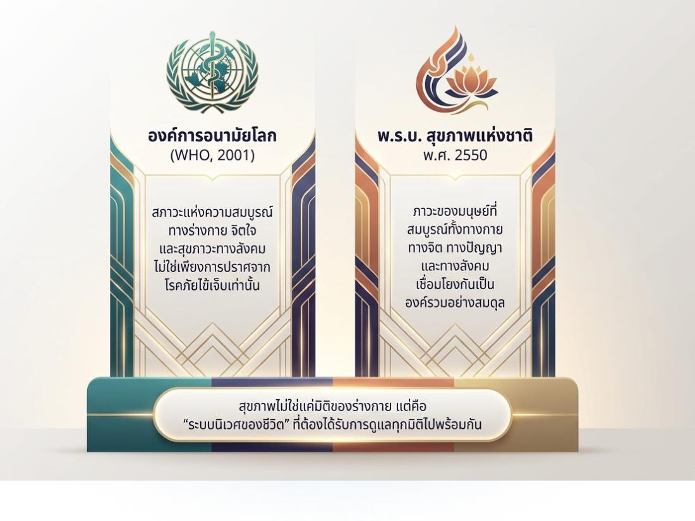
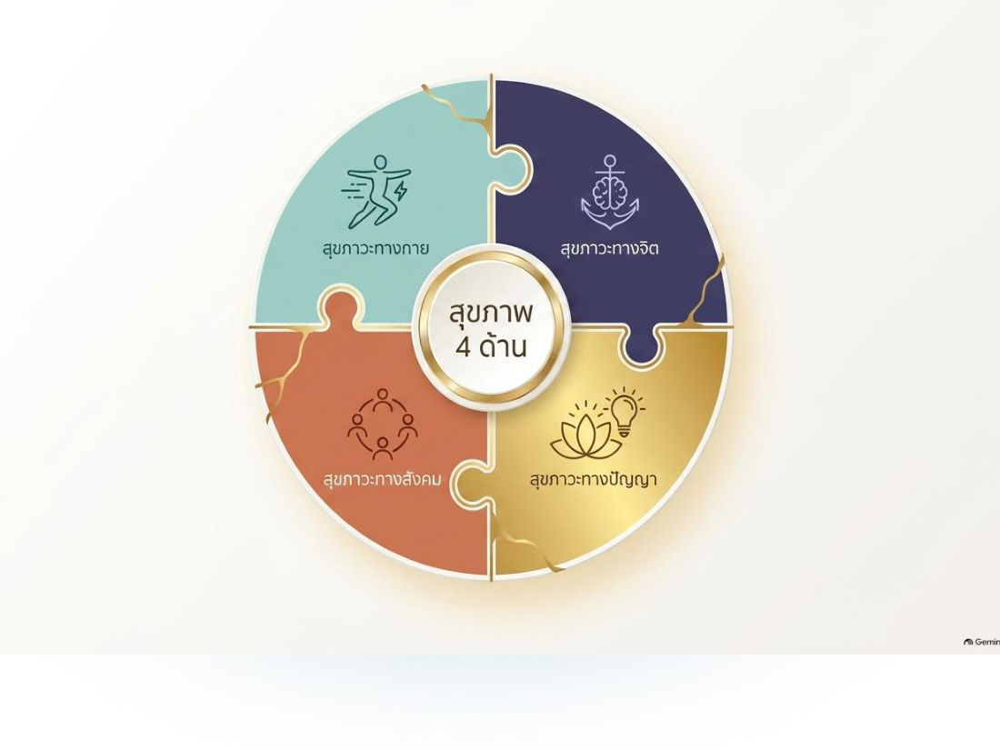
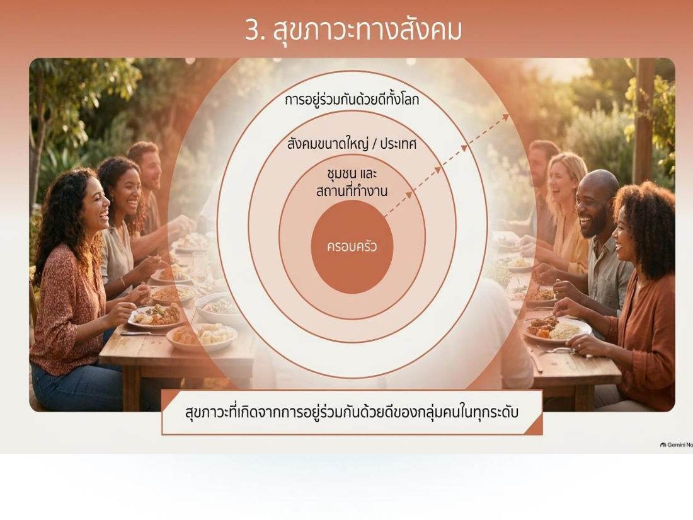
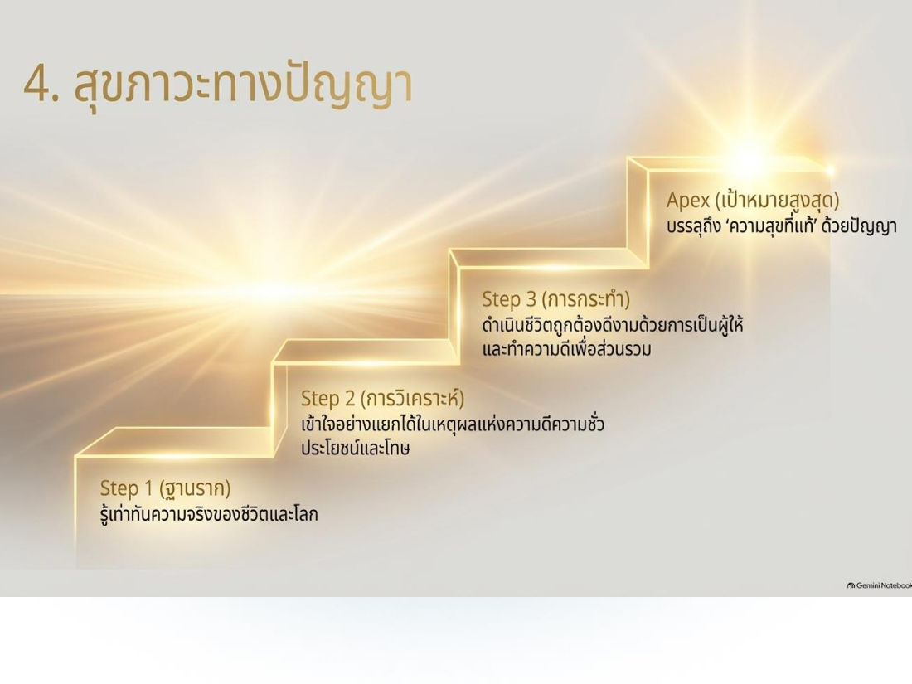
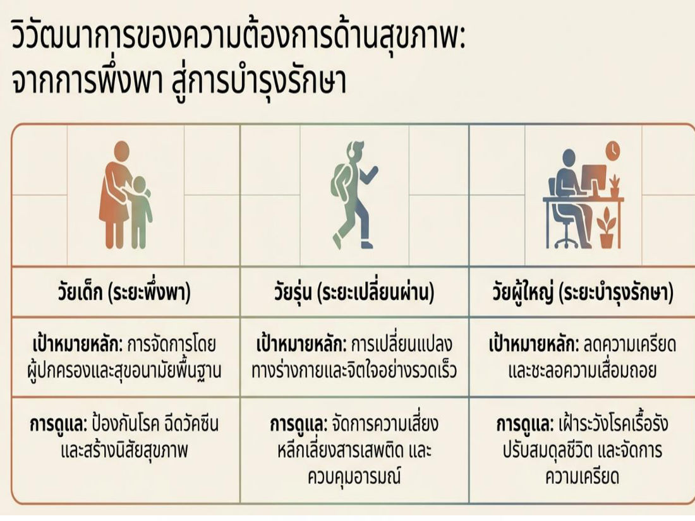
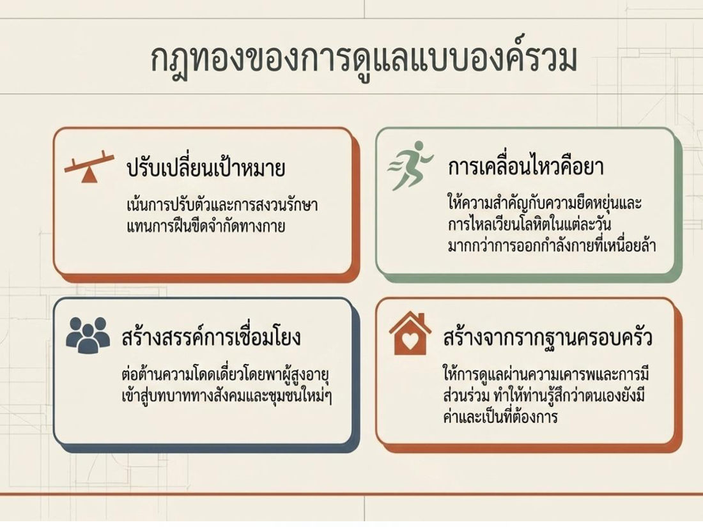
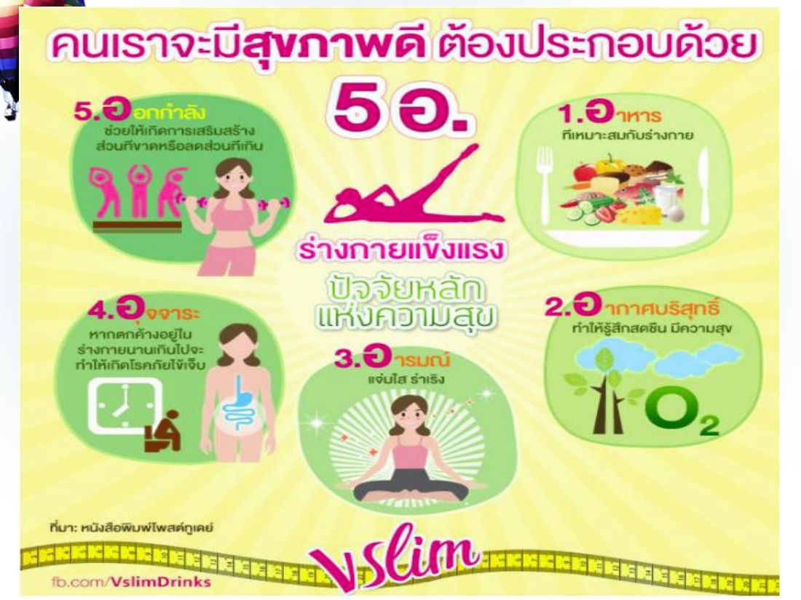

# สรุป: บทที่ 6 สุขภาพและการออกกำลังกาย (GE110)

> บทนี้เรียนว่า "สุขภาพ" ไม่ใช่แค่ไม่ป่วย แต่คือความสมบูรณ์หลายมิติ (กาย จิต สังคม ปัญญา) จากนั้นไล่การดูแลสุขภาพตามวัฏจักรชีวิต ตั้งแต่เลือกคู่ ตั้งครรภ์ วางแผนครอบครัว จนถึงวัยสูงอายุ แล้วจบด้วยการออกกำลังกาย (BMI, ชีพจร, 5 ขั้นตอน) และหลัก 5 อ.
> ในข้อสอบฝึก บทนี้ออก **18 ข้อ** (ข้อ 19–36) เน้น: นิยามสุขภาพ (WHO / พ.ร.บ. 2550), สุขภาวะ 4 ด้าน, BMI, ชีพจร, ขั้นตอนออกกำลังกาย, 5 อ.

## สารบัญ
1. ความหมายของสุขภาพ (3 นิยาม)
2. สุขภาพ 4 ด้าน
3. จุดเริ่มต้นการดูแลสุขภาพ & วัฏจักรชีวิต
4. ปัจจัย 5 ข้อ เพื่อชีวิตมีคุณภาพตั้งแต่เกิด (เลือกคู่ → ดูแลแต่ละวัย)
5. การออกกำลังกาย: ความหมาย, BMI, ปัจจัย 11 ข้อ, ขั้นตอน 5 ขั้น
6. หลัก 5 อ.

---

## 1. ความหมายของ "สุขภาพ"

**สุขภาพ ≠ การไม่ป่วย** → สุขภาพ = **ความสมบูรณ์แบบองค์รวม**

| แหล่ง | นิยาม |
|---|---|
| **ในบทเรียน** | คุณภาพชีวิตที่สมบูรณ์ทั้ง **ร่างกาย จิตใจ** และ **ปรับตัวเข้ากับสภาพแวดล้อมได้อย่างเหมาะสม** |
| **WHO (2001)** | สภาวะแห่งความสมบูรณ์ **ทางร่างกาย จิตใจ และสุขภาวะทางสังคม** ไม่ใช่เพียงการปราศจากโรคภัยไข้เจ็บเท่านั้น (3 มิติ) |
| **พ.ร.บ.สุขภาพแห่งชาติ พ.ศ. 2550** | ภาวะของมนุษย์ที่สมบูรณ์ทั้ง **ทางกาย ทางจิต ทางปัญญา และทางสังคม** เชื่อมโยงกันเป็นองค์รวมอย่างสมดุล (4 มิติ) |

> สุขภาพไม่ใช่แค่มิติของร่างกาย แต่คือ **"ระบบนิเวศของชีวิต"** ที่ต้องดูแลทุกมิติไปพร้อมกัน

> ⚠️ **WHO = 3 ด้าน (กาย จิต สังคม)** · **พ.ร.บ. 2550 = 4 ด้าน (เพิ่ม "ปัญญา")** — ข้อสอบชอบสลับกัน

## 2. สุขภาพ 4 ด้าน (สุขภาวะ)

| ด้าน | องค์ประกอบ |
|---|---|
| **1. สุขภาวะทางกาย** | (1) **ปราศจากโรคภัย** ร่างกายแข็งแรง (2) **ความมั่นคงพื้นฐาน** ไม่ขาดแคลนวัตถุปัจจัย ปลอดภัยในชีวิตและทรัพย์สิน (3) **สภาพแวดล้อม** อยู่ในสิ่งแวดล้อมที่เหมาะสมต่อการดำรงชีวิต |
| **2. สุขภาวะทางจิต** | (1) **ความเข้มแข็ง** — สุขภาพจิตดี จิตใจเข้มแข็ง (2) **ความเมตตา** — จิตเอื้ออาทร (3) **ความสงบ** — มีสมาธิ จดจ่อ (4) **ความเป็นอิสระ** — หลุดพ้นจากความครอบงำของกิเลส |
| **3. สุขภาวะทางสังคม** | สุขภาวะจากการอยู่ร่วมกันด้วยดีของกลุ่มคนทุกระดับ ขยายวงจาก **ครอบครัว → ชุมชนและที่ทำงาน → สังคมขนาดใหญ่/ประเทศ → การอยู่ร่วมกันด้วยดีทั้งโลก** |
| **4. สุขภาวะทางปัญญา** (บันได 4 ขั้น) | **Step 1 ฐานราก:** รู้เท่าทันความจริงของชีวิตและโลก → **Step 2 การวิเคราะห์:** เข้าใจแยกได้ในเหตุผลแห่งความดีความชั่ว ประโยชน์และโทษ → **Step 3 การกระทำ:** ดำเนินชีวิตถูกต้องดีงามด้วยการเป็นผู้ให้ ทำความดีเพื่อส่วนรวม → **Apex เป้าหมายสูงสุด:** บรรลุ "ความสุขที่แท้" ด้วยปัญญา |

> ⚠️ กับดัก: "ความมั่นคงพื้นฐาน ไม่ขาดแคลนวัตถุปัจจัย" อยู่ใน **ทางกาย** (ไม่ใช่ทางสังคม) · "ความเมตตา" อยู่ใน **ทางจิต** · "ความมั่งคั่ง/การเงิน" **ไม่ใช่** ด้านใดเลย

**สุขภาพดีเราต้องดูแลตนเอง** — นอกจากอาหาร อากาศบริสุทธิ์ และจิตใจสบายไม่เครียด การออกกำลังกายก็เป็นสิ่งจำเป็น

## 3. จุดเริ่มต้นการดูแลสุขภาพ & วัฏจักรชีวิต (Life cycle)

การดูแลสุขภาพเริ่มตั้งแต่ **แรกเกิด → วัยเด็ก → วัยรุ่น → วัยชรา** แสดงผ่าน **วัฏจักรของครอบครัว** เพราะ **ครอบครัวที่สมบูรณ์เป็นรากฐานของสถาบันสังคม** และสร้างคุณภาพชีวิตให้ประชากร

วัฏจักรชีวิต: เกิด → เด็ก → หนุ่มสาว → รับปริญญา → ทำงาน → แต่งงาน → เลี้ยงลูก → แก่ชรา → เจ็บป่วย → ตาย

## 4. ปัจจัย 5 ข้อ เพื่อชีวิตที่มีคุณภาพตั้งแต่แรกเกิด

1. การเลือกคู่ครอง
2. การเตรียมตัวก่อนแต่งงาน
3. การดูแลสุขภาพเมื่อตั้งครรภ์
4. การวางแผนครอบครัว
5. การดูแลสุขภาพตนเองในแต่ละวัย

### 4.1 การเลือกคู่ครอง
ใช้อารมณ์/ความรักตัดสินอย่างเดียวไม่ได้ ต้องมีเกณฑ์ 2 ข้อ:
- **1.1 มีความรักเป็นพื้นฐาน** — ความรัก = ความผูกพัน หวงแหน ปรารถนาดี ห่วงใย อาจเริ่มจากความพึงพอใจภายนอก (รูปร่าง บุคลิก นิสัย) แล้วพัฒนาเป็นความผูกพันที่มากกว่า → ต้องรักคู่ที่เลือก และเลือกคนที่รักเรา (เป็นข้อสำคัญข้อแรก)
- **1.2 มีสภาวะด้านต่าง ๆ ที่เหมาะสม:** อายุ (บรรลุนิติภาวะ) · สุขภาพกาย โรคประจำตัว โรคพันธุกรรม · วุฒิภาวะทางอารมณ์ · ระดับสติปัญญา (ไม่ต่างกันมาก) · บุคลิกภาพ · ศาสนา (พิธีกรรมต่างกัน) · วัฒนธรรม (คล้ายกันปรับตัวง่าย) · ฐานะเศรษฐกิจ (ปัญหาค่าใช้จ่าย)

### 4.2 การเตรียมตัวก่อนแต่งงาน
เตรียมสุขภาพ โดยเฉพาะหญิงวัยเจริญพันธุ์ (เปรียบเป็นดอกไม้ที่สวย ลำต้นแข็งแรง)
- 2.1 เตรียมสุขภาพร่างกายตนเอง
- 2.2 ตรวจสอบร่างกายตนเอง: (1) โรคที่มีผลต่อการตั้งครรภ์ (2) โรคติดเชื้อจากเพศสัมพันธ์ (3) โรคถ่ายทอดทางพันธุกรรม

### 4.3 การดูแลสุขภาพเมื่อตั้งครรภ์ (พัฒนาการทารก 3 ระยะ)

| ระยะ | อายุครรภ์ | จุดสำคัญ |
|---|---|---|
| ระยะแรก | **1–3 เดือน** | ต้องดูแลพิเศษ เริ่ม **แพ้ท้อง** ทารกเล็ก กระทบกระเทือน **แท้งง่าย** โอกาส **พิการสูง** → หลีกเลี่ยงยา ยาเสพติด สารพิษ |
| ระยะที่ 2 | **4–6 เดือน** | ความเสี่ยงแท้ง **ลดลง** ทารกแข็งแรง → กินอาหาร **โปรตีน** เพิ่มความแข็งแรงให้ทารก |
| ระยะที่ 3 | **7–9 เดือน** | ไตรมาสสุดท้าย ทารกแข็งแรงสมบูรณ์เต็มที่ **สร้างอวัยวะครบ** คลอดได้ รอดชีวิตสูง |

### 4.4 การวางแผนครอบครัว
= คู่สมรสคิดล่วงหน้าว่าจะมีลูก **เมื่อใด กี่คน** ใช้วิธีป้องกันการตั้งครรภ์ช่วงที่ไม่ต้องการ หลีกเลี่ยงการตั้งครรภ์ไม่พร้อม (กาย ใจ สังคม) ควบคุมเวลาตั้งครรภ์ให้เหมาะกับอายุและสุขภาพ และเว้นระยะมีบุตรอย่างเหมาะสม

| แบบ | วิธี |
|---|---|
| **4.1 ชั่วคราว** | ยาเม็ดคุมกำเนิดฮอร์โมนรวมชนิดโมโนเฟสิค · **ยาคุมฉุกเฉิน** (ใช้เฉพาะฉุกเฉิน ไม่ควรใช้วางแผนต่อเนื่อง) · **ยาฝังคุมกำเนิด** (ฮอร์โมนโปรเจสโตเจนสังเคราะห์ คุมได้ **5 ปี**) · **แผ่นแปะคุมกำเนิด** ORTHO EVRA (แปะผิวหนัง) |
| **4.2 ถาวร** (ผ่าตัด มีบุตรไม่ได้อีก) | **ทำหมันชาย** — ตัดท่อนำอสุจิให้ขาดแล้วผูกปลายทั้ง 2 ข้าง อสุจิออกไม่ได้ (ประสิทธิภาพสูง) · **ทำหมันหญิง** — ตัดท่อนำไข่แล้วผูกปลาย ไข่พบอสุจิไม่ได้ ทำได้ 2 ระยะ: **หลังคลอด** และ **ระยะปกติ** |

### 4.5 การดูแลสุขภาพตนเองในแต่ละวัย
เปรียบร่างกายเป็นเครื่องจักร ใช้แล้วไม่ดูแลก็ทรุดโทรม แต่ **เปลี่ยนอะไหล่ไม่ได้** เหมือนเครื่องจักร

**วิวัฒนาการความต้องการด้านสุขภาพ: จากการพึ่งพา สู่การบำรุงรักษา**

| วัย | เป้าหมายหลัก | การดูแล |
|---|---|---|
| เด็ก (ระยะพึ่งพา) | ผู้ปกครองจัดการ และสุขอนามัยพื้นฐาน | ป้องกันโรค ฉีดวัคซีน สร้างนิสัยสุขภาพ |
| วัยรุ่น (ระยะเปลี่ยนผ่าน) | เปลี่ยนแปลงทางกายและใจอย่างรวดเร็ว | จัดการความเสี่ยง หลีกเลี่ยงสารเสพติด ควบคุมอารมณ์ |
| ผู้ใหญ่ (ระยะบำรุงรักษา) | ลดความเครียด ชะลอความเสื่อม | เฝ้าระวังโรคเรื้อรัง ปรับสมดุลชีวิต จัดการความเครียด |

- **5.1 เด็ก** — ใส่ใจการขับถ่าย กิน นอน ความสะอาด: (1) เข้าใจสมุดบันทึกสุขภาพ (2) พบแพทย์ตามนัด (3) มีแพทย์ประจำตัว (4) ตั้งคำถามเสมอ (5) สังเกตพฤติกรรม (6) เตรียมยาสำหรับเด็ก
- **5.2 วัยรุ่น** — เสี่ยงปัญหา **สุขภาพจิต อุบัติเหตุ ความรุนแรง** มากกว่าวัยอื่น โรคที่พบ: (1) โรคติดเชื้อ (2) อุบัติเหตุ (3) ยาเสพติด (ฝิ่น เฮโรอีน ยาบ้า ยาเลิฟ/อีจอย สารระเหย เซโคนาล บาร์บิทูเรต สุรา กัญชา)
- **5.3 ผู้ใหญ่** — ภาระหนัก (งานบ้าน อบรมลูก งาน) ปัญหากดดันอาจนำไปสู่โรคร้ายแรง **หลักตรวจสุขภาพ 3 ขั้น:** (1) พบแพทย์ ซักประวัติการเจ็บป่วย (2) ตรวจร่างกาย — ความดัน ส่วนสูง น้ำหนัก ความอ้วน การได้ยิน สายตา ปัสสาวะ เลือด คลื่นหัวใจ เอกซเรย์ปอด (3) ดูแลต่อที่บ้าน — ระวังอาหาร และที่สำคัญคือ **การนอน**
- **5.4 สูงอายุ** — ปัญหาพบบ่อย: เครียด วิตกกังวล ซึมเศร้า นอนไม่หลับ สมองเสื่อม
  1. ด้านจิตใจ — อย่าอยู่คนเดียวเมื่อเศร้า พบปะพูดคุย ทำงานอดิเรก ทำใจให้สงบ
  2. ด้านร่างกาย — ร่างกายไม่แข็งแรง ความจำเสื่อม ป่วยหายช้า → ดูแลตนเอง รู้จักประมาณตน อาจมีเพื่อนต่างวัย
  3. ปรับตัวเข้ากับสังคม — อย่าหวังให้ลูกหลานตอบแทน (หวังผลแล้วไม่สบายใจ) ควรเยี่ยมเยียนผู้อื่นยามเจ็บไข้ (ช่วงที่ว้าเหว่ที่สุด)
  4. บทบาทลูกหลาน — ดูแลอาหาร พักผ่อน ออกกำลังกาย ตรวจสุขภาพ ให้ความเป็นใหญ่ในบ้าน เคารพยกย่อง ระวังคำพูด

**กฎทองของการดูแลแบบองค์รวม (ผู้สูงอายุ):** ปรับเปลี่ยนเป้าหมาย (ปรับตัว/สงวนรักษา แทนการฝืนขีดจำกัด) · การเคลื่อนไหวคือยา (ยืดหยุ่น การไหลเวียนเลือดรายวัน มากกว่าออกกำลังหนัก) · สร้างสรรค์การเชื่อมโยง (ต้านความโดดเดี่ยว) · สร้างจากรากฐานครอบครัว (เคารพ ให้มีส่วนร่วม รู้สึกมีค่า)

## 5. การออกกำลังกาย

**ความหมาย:** การเข้าร่วมกิจกรรมทางกายที่ร่างกายเคลื่อนไหว โดย **หดและยืดกล้ามเนื้อ** ข้อเคลื่อนไหว มีแรงกดที่กระดูก เช่น เดินเร็ว วิ่ง แอโรบิค กีฬาที่ไม่มุ่งแข่งขัน — ต้อง **หนักพอและนานพอ** (แบบใช้ออกซิเจน) → ระบบหายใจ ไหลเวียนเลือด กล้ามเนื้อ กระดูก แข็งแรงขึ้น สุขภาพกายและจิตดีขึ้น

### ดัชนีมวลกาย (BMI) ⭐

**BMI = น้ำหนัก (กก.) ÷ [ส่วนสูง (ม.)]²**

| BMI | เกณฑ์ |
|---|---|
| < 18.5 | น้ำหนักน้อย |
| 18.5 – 24.9 | น้ำหนักเหมาะสม |
| 25 – 29.9 | น้ำหนักเกิน |
| > 30 | โรคอ้วน |

> ตัวอย่าง: หนัก 60 กก. สูง 1.60 ม. → 60 ÷ (1.6 × 1.6) = 60 ÷ 2.56 ≈ **23.4 → เหมาะสม**
> ⚠️ ส่วนสูงต้องเป็น **เมตร** และ **ยกกำลังสอง**

### ปัจจัยที่ควรคำนึงก่อนออกกำลังกาย (11 ข้อ)
อายุ · เพศ · สภาพร่างกาย · สภาพอากาศ · การแต่งกาย · สภาพกระเพาะอาหาร · การดื่มน้ำ · ความเจ็บป่วย · จิตใจ · เวลา · พันธุกรรม

### ขั้นตอนการออกกำลังกาย 5 ขั้น ⭐

1. **ตรวจสุขภาพ** — ปรึกษาแพทย์/ผู้เชี่ยวชาญวิทยาศาสตร์การกีฬาก่อน (ไม่เหมาะกับร่างกายอาจถึงชีวิต) คนหนุ่มสาว **ต่ำกว่า 35 ปี** ที่แข็งแรงเริ่มได้เลย แต่เริ่มเบา ๆ แล้วค่อยเพิ่ม
2. **อบอุ่นร่างกาย (warm up)** — **กระตุ้นอวัยวะให้พร้อมทำงาน ลดการบาดเจ็บ** บริหาร+ยืดข้อและกล้ามเนื้อ **จากบนลงล่าง จากต้นไปปลาย** แล้วออกเบา ๆ เช่น วิ่งเหยาะ เดินเร็ว **5–10 นาที** ให้หัวใจค่อย ๆ เต้นเร็วขึ้น
3. **กำหนดความหนักด้วยชีพจร** — จับที่ **เส้นเลือดแดงที่คอ** (ใต้คาง หลังลูกกระเดือก) หรือ **ข้อมือด้านใน**
   - **ชีพจร/นาที = 4 × จำนวนครั้งที่จับได้ใน 15 วินาที**
   - ปกติ: **ชาย 72 ± 5** ครั้ง/นาที · **หญิง 78 ± 5** ครั้ง/นาที
4. **ออกกำลังด้วยระยะเวลาเหมาะสม** — สัมพันธ์กับความหนัก อายุ สภาพร่างกาย ผู้เริ่มต้นออกบ่อยแต่พอควร ค่อย ๆ เพิ่มเวลา **เป้าหมาย 30 นาที**
5. **ผ่อนคลายกล้ามเนื้อ (cool down)** — ลดความเข้มลงแบบ **ย้อนกระบวนการอบอุ่น** ให้หัวใจเต้นช้าลง และให้เลือดที่คั่งตามกล้ามเนื้อแขนขา **กลับเข้าระบบไหลเวียน** ไปเลี้ยงอวัยวะสำคัญ โดยเฉพาะ **สมอง**

> 💡 ตัวเลขที่ต้องจำ: warm up 5–10 นาที · ชีพจร ×4 (15 วิ) · ชาย 72 หญิง 78 · เป้าหมาย 30 นาที · อายุ < 35 เริ่มได้เลย

## 6. หลัก 5 อ. (ดูแลสุขภาพตนเอง)

| อ. | รายละเอียด |
|---|---|
| **อาหาร** | ถูกหลักโภชนาการ โดยเฉพาะอาหารท้องถิ่นที่มีคุณค่า |
| **ออกกำลังกาย** | ร่างกายแข็งแรง เสริมส่วนที่ขาด ลดส่วนที่เกิน |
| **อากาศ** | สิ่งแวดล้อมดี ไร้มลพิษ สร้างพื้นที่สีเขียวในชุมชน บ้าน ที่ทำงาน |
| **อุจจาระ** | ขับถ่ายมีประสิทธิภาพ ทุกวันสม่ำเสมอ (ตกค้างนานทำให้เกิดโรค) |
| **อารมณ์** | กายกับอารมณ์แยกกันไม่ได้ · **หัวเราะ 1 นาที = พักผ่อน 45 นาที** |

> ⚠️ 5 อ. **ไม่มี "อาชีพ"** หรือ "อนามัย"

---

## คำศัพท์สำคัญ

| คำศัพท์ | ความหมาย | จำง่าย ๆ ว่า |
|---|---|---|
| สุขภาวะ | ภาวะที่เป็นสุขสมบูรณ์ในแต่ละมิติ | กาย/จิต/สังคม/ปัญญา |
| BMI | น้ำหนัก(กก.) ÷ ส่วนสูง(ม.)² | 18.5–24.9 = ดี |
| ชีพจร | จำนวนครั้งเต้นของหัวใจต่อนาที | 15 วิ × 4 |
| Warm up | อบอุ่นร่างกาย กระตุ้นอวัยวะ ลดบาดเจ็บ | 5–10 นาที |
| Cool down | ผ่อนคลาย ให้เลือดกลับไปเลี้ยงสมอง | ย้อน warm up |
| การวางแผนครอบครัว | กำหนดเวลา/จำนวนลูก เว้นระยะ | ชั่วคราว vs ถาวร |
| ยาฝังคุมกำเนิด | โปรเจสโตเจนสังเคราะห์ | 5 ปี |

## สรุปท้ายบท / จุดที่มักออกสอบ

- สุขภาพ = กาย + ใจ + ปรับตัวเข้ากับสิ่งแวดล้อม · **WHO 2001 = กาย จิต สังคม** · **พ.ร.บ. 2550 = กาย จิต ปัญญา สังคม**
- สุขภาวะทางกาย = ปราศจากโรค + ความมั่นคงพื้นฐาน + สภาพแวดล้อม · ทางจิต = เข้มแข็ง เมตตา สงบ อิสระจากกิเลส
- สังคม: ครอบครัว → ชุมชน → ประเทศ → โลก · ปัญญา ขั้นฐานราก = รู้เท่าทันความจริงของชีวิตและโลก
- ตั้งครรภ์ 1–3 เดือน เสี่ยงแท้ง/พิการสูง · 4–6 เดือน กินโปรตีน · 7–9 เดือน อวัยวะครบ
- BMI > 30 = โรคอ้วน · 25–29.9 = เกิน
- ขั้นแรกของออกกำลังกาย = **ตรวจสุขภาพ** · warm up = กระตุ้นอวัยวะ ลดบาดเจ็บ
- ชีพจร = 15 วินาที × 4 · ชาย 72 หญิง 78 · เป้าหมายผู้เริ่มต้น 30 นาที
- 5 อ. = อาหาร ออกกำลังกาย อากาศ อุจจาระ อารมณ์
- (เสริม — ไม่มีในสไลด์ แต่ข้อสอบฝึกข้อ 27 ถาม) **โรคติดต่อ** มีตัวการคือ **เชื้อโรค** เช่น แบคทีเรีย ไวรัส เชื้อรา ปรสิต ที่แพร่จากคนสู่คน หรือสัตว์สู่คน (ต่างจากโรคไม่ติดต่อที่มาจากพฤติกรรม/พันธุกรรม)
