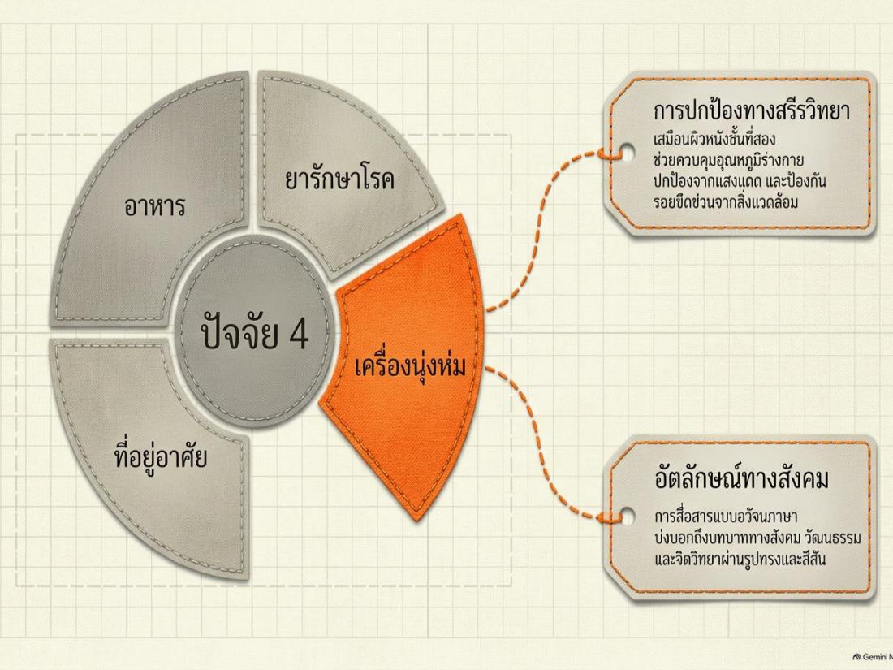
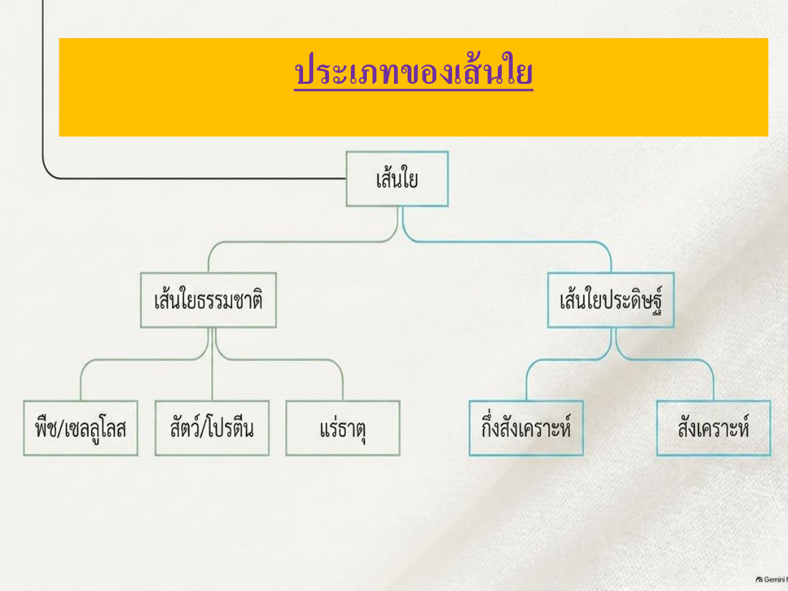
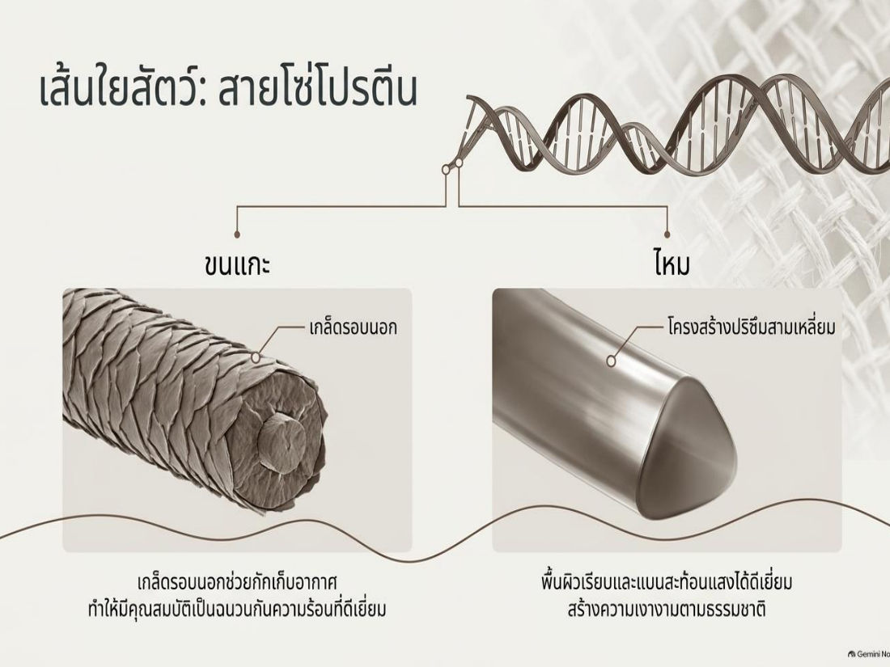
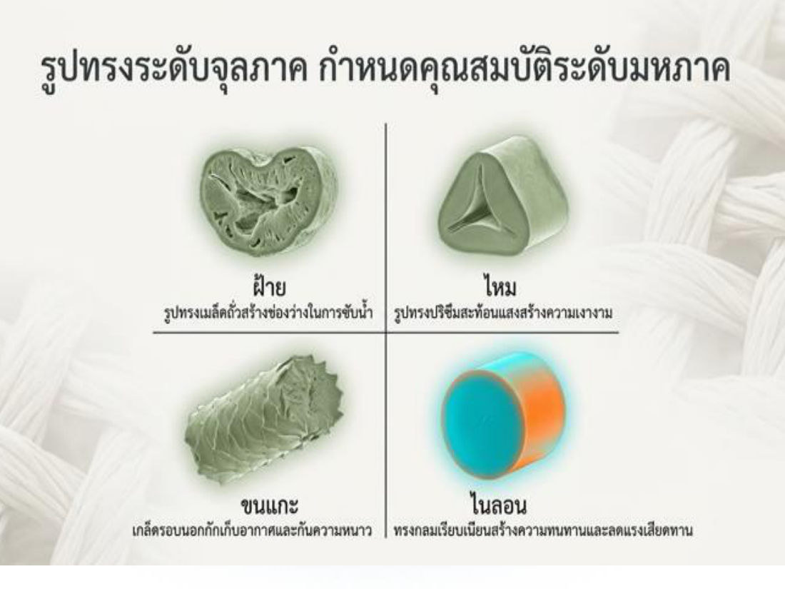
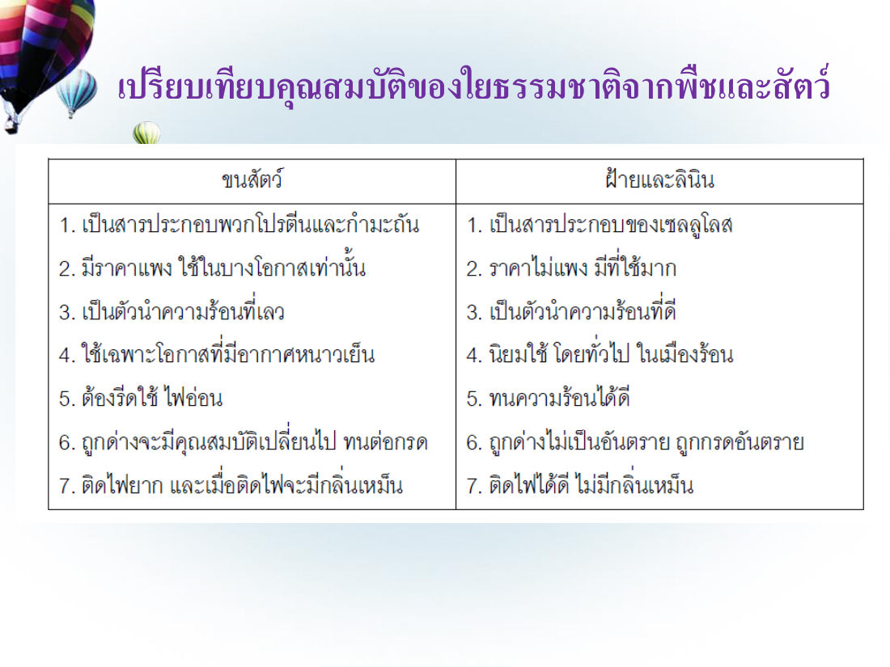
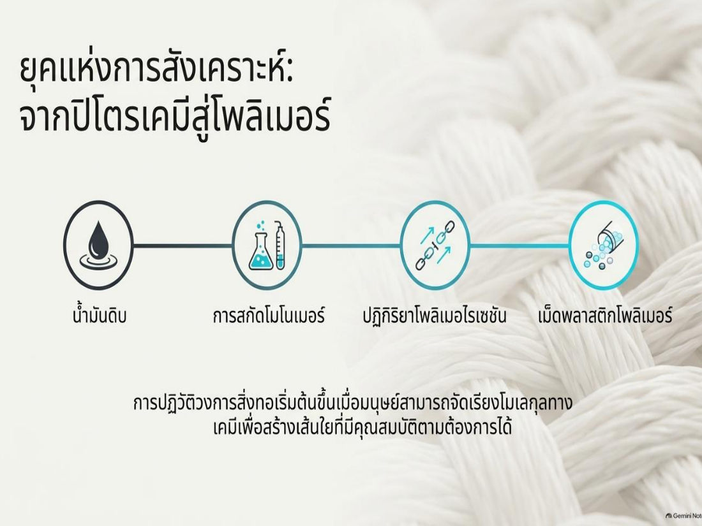
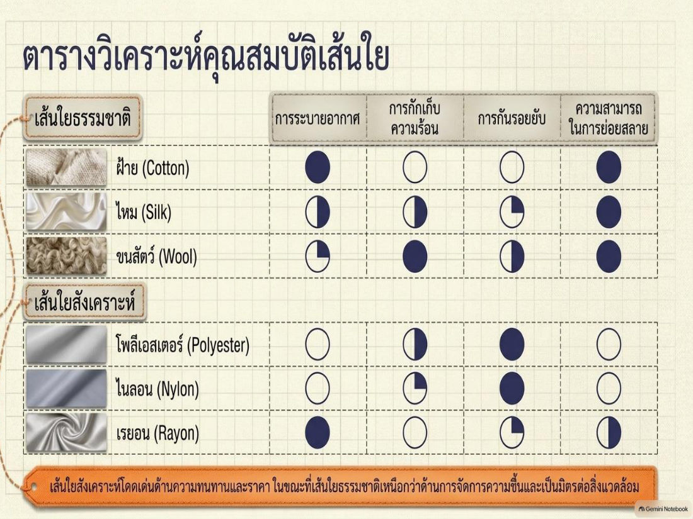
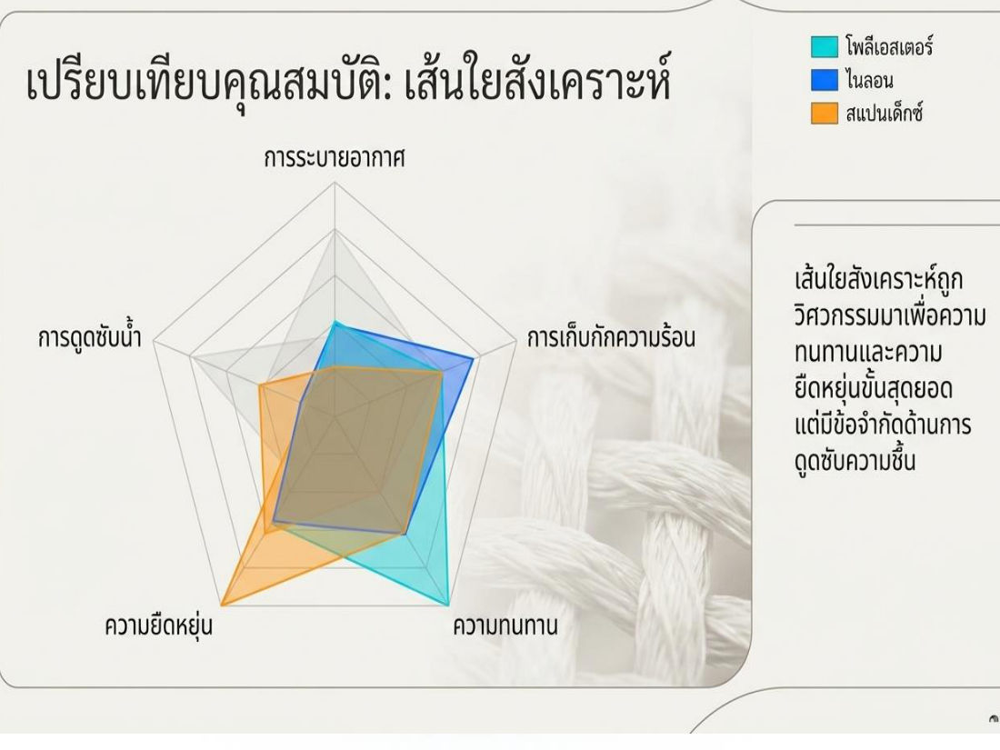
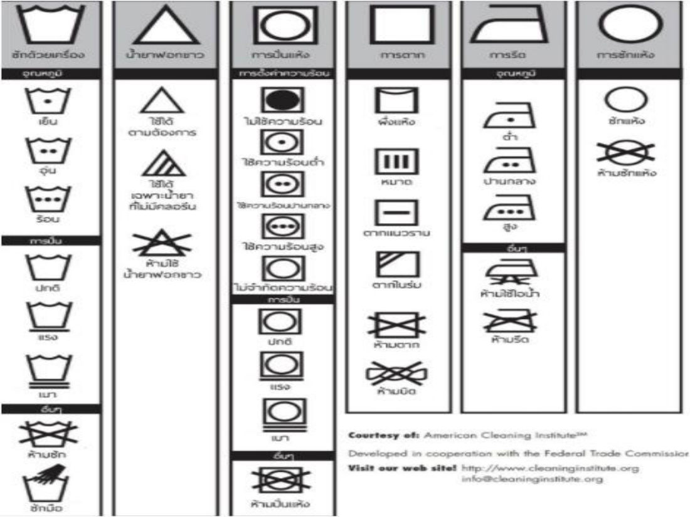

# สรุป: บทที่ 7 เครื่องนุ่งห่ม (GE110)

> เครื่องนุ่งห่มเป็น 1 ในปัจจัย 4 บทนี้เรียนตั้งแต่หน่วยเล็กสุด "เส้นใย" → เส้นด้าย → ผ้า แบ่งเส้นใยธรรมชาติ (พืช/สัตว์/แร่) กับเส้นใยประดิษฐ์ (กึ่งสังเคราะห์/สังเคราะห์) กระบวนการผลิต นวัตกรรมเสื้อผ้า 4 กลุ่ม และการเลือกซื้อ/ดูแลรักษา (สัญลักษณ์ป้ายผ้า)
> ในข้อสอบฝึก บทนี้ออก **18 ข้อ** (ข้อ 37–54) เน้น: นิยาม 4 คำ, ตัวอย่างเส้นใยแต่ละกลุ่ม, เรยอน, Vicara/Ardil, fiber spinning 3 แบบ, เสื้อนาโน, เสื้อคุมเบาหวาน, สัญลักษณ์ป้ายผ้า

## สารบัญ (ตามสไลด์)
1. ความหมายและความสำคัญของเครื่องนุ่งห่ม
2. ความหมายของศัพท์ที่เกี่ยวข้อง
3. ประเภทของเส้นใย
4. เส้นใยธรรมชาติ
5. เส้นใยสังเคราะห์
6. กระบวนการผลิตเส้นใยประดิษฐ์
7. ผลิตภัณฑ์เครื่องนุ่งห่มที่เป็นนวัตกรรมใหม่ (4 กลุ่ม)
8. การเลือกซื้อ และการดูแลรักษาเสื้อผ้า

---

## 1. ความหมายและความสำคัญของเครื่องนุ่งห่ม

- อดีต: ใช้วัสดุธรรมชาติ เช่น ใบไม้ ปกปิดร่างกาย ให้ความอบอุ่น · เขตหนาวใช้ขนสัตว์ทำเสื้อ
- ปัจจุบัน: นอกจากปกปิด/ห่อหุ้มร่างกาย ยังบ่งบอก **วัฒนธรรม ฐานะ เชื้อชาติ**
- เครื่องนุ่งห่มประกอบด้วยเส้นใย 2 ประเภท: **ธรรมชาติ** และ **สังเคราะห์**

**ความหมาย:** เสื้อผ้าเครื่องแต่งกาย พัฒนาจากหน่วยเล็กสุดคือ **เส้นใย** → ถัก/ทอเป็นผืนผ้า → ตกแต่ง พิมพ์ลาย → ผลิตภัณฑ์สิ่งทอ ซึ่งรวมถึง **สิ่งทอในบ้าน** (ผ้าห่ม ผ้าปูที่นอน ปลอกหมอน ผ้าม่าน) และ **สิ่งทอในอุตสาหกรรม**

**บทบาทในปัจจัย 4:** (1) **การปกป้องทางสรีรวิทยา** — เหมือน "ผิวหนังชั้นที่สอง" ควบคุมอุณหภูมิ กันแดด กันรอยขีดข่วน (2) **อัตลักษณ์ทางสังคม** — สื่อสารแบบอวัจนภาษา บอกบทบาทสังคม วัฒนธรรม จิตวิทยา ผ่านรูปทรงและสีสัน

## 2. ความหมายของศัพท์ที่เกี่ยวข้อง ⭐

| คำ | ความหมาย |
|---|---|
| **เส้นใย (Fiber)** | **ต้นกำเนิดของสิ่งทอ** เป็นเส้นเล็ก ยาว มีทั้งธรรมชาติและมนุษย์ประดิษฐ์ ใช้ **ปั่นและเข้าเกลียวเป็นเส้นด้าย** เพื่อผลิตผืนผ้า |
| **เส้นด้าย (Yarn)** | การนำ **เส้นใยหลาย ๆ เส้นมารวมกันแล้วบิดหรือเข้าเกลียว** หรือนำเส้นใยมาเรียงและต่อกัน |
| **สิ่งทอ (Textiles)** | สิ่งทอหรือผลิตภัณฑ์สิ่งทอ **ทุกชนิดที่ผลิตจากเส้นใย ทั้งวิธีทอและไม่ทอ** |
| **ผ้า (Fabric)** | สิ่งทอที่เป็น **ผืน** มีความกว้าง ยาว หนา ต่างกันตามกรรมวิธีผลิต |

> 💡 ลำดับ: **Fiber → Yarn → Fabric** (ทั้งหมดอยู่ในร่ม "Textiles")

## 3. ประเภทของเส้นใย

- **เส้นใยธรรมชาติ** → จาก **พืช (เซลลูโลส)** / **สัตว์ (โปรตีน)** / **แร่ธาตุ**
- **เส้นใยประดิษฐ์** → **กึ่งสังเคราะห์** (ประดิษฐ์จากวัตถุธรรมชาติ เช่น เรยอน) / **สังเคราะห์** (จากสารเคมี) / จากวัสดุอื่น ๆ

**ธรรมชาติ vs สังเคราะห์ (infographic)**
- **ใยสังเคราะห์** — มนุษย์สร้างขึ้นเอง ปรับปรุงคุณสมบัติตามการใช้งาน มีความเงา ยืดหยุ่น ทนทาน แห้งง่าย
- **ใยธรรมชาติ** — ได้จากพืชและสัตว์ (จากพืชราคาถูกกว่าจากสัตว์ มีมากกว่า นิยมในบ้านเราเพราะหาง่าย) เช่น ฝ้าย ลินิน ป่าน ปอ ใยไผ่
  - **ใยป่าน** ทนต่อการซักรีด เงา แห้งเร็ว · **ใยไผ่** ดีต่อสุขภาพ ต้านแบคทีเรีย ลดกลิ่นอับ ยืดหยุ่น ระบายอากาศ ซับเหงื่อ เบา · **ใยฝ้าย (Cotton)** ราคาถูก ทนทาน เรียบเป็นเงา ดูดซับน้ำดี · **ใยลินิน** ระบายอากาศดีมาก ซับเหงื่อดี แต่ยับง่าย

## 4. เส้นใยธรรมชาติ

### 4.1 เส้นใยเซลลูโลสจากพืช ⭐

| กลุ่ม | ชื่อภาษาอังกฤษ | ตัวอย่าง |
|---|---|---|
| เส้นใยที่ **หุ้มเมล็ด** | **Surface fibers** | **ฝ้าย** |
| เส้นใยจาก **เปลือกไม้** | **Soft fibers** | **ลินิน ปอ กัญชา** |
| เส้นใยจาก **ใบ** | **Hard fibers** | **สับปะรด ป่านศรนารายณ์ กล้วย ย่านลิเภา** |

> 💡 จำ: เมล็ด = Surface (ผิวเมล็ด) · เปลือก = Soft · ใบ = Hard

คุณสมบัติเด่นในสไลด์: **ฝ้าย** นุ่ม ดูดซับความชื้นดี · **ลินิน** แข็งแรง ระบายความร้อนเยี่ยม · **กัญชง** ทนรังสียูวีและแบคทีเรีย

### 4.2 เส้นใยจากสัตว์ (โปรตีน)
- ตัวอย่าง: **ขนแกะ** และ **ใยจากรังไหม**
- สมบัติคล้ายโปรตีนอื่น: **เปียกน้ำแล้วความเหนียวและความแข็งแรงลดลง** · ถูกแดดนาน ๆ จะ **สลายหรือกรอบ**
- **ขนแกะ** มี **เกล็ดรอบนอก** กักเก็บอากาศ → เป็นฉนวนกันความร้อน/กันหนาวดีเยี่ยม
- **ไหม** โครงสร้าง **ปริซึมสามเหลี่ยม** ผิวเรียบ สะท้อนแสง → เงางามตามธรรมชาติ

**รูปทรงระดับจุลภาค กำหนดคุณสมบัติระดับมหภาค:** ฝ้าย = รูปเมล็ดถั่ว มีช่องว่างซับน้ำ · ไหม = ปริซึม สะท้อนแสงเงางาม · ขนแกะ = เกล็ดกักอากาศ กันหนาว · ไนลอน = ทรงกลมเรียบ ทนทาน ลดแรงเสียดทาน

### 4.3 กระบวนการผลิตเส้นใยขนสัตว์ (Wool)
1. นำขนที่ **ตัด/เล็ม** มา **แบ่งเกรดตามคุณภาพ** ← ขั้นแรก
2. ผสมขนเกรดเดียวกันให้ทั่ว
3. ทำความสะอาดคราบไขมันและสิ่งสกปรกด้วยสบู่
4. **สางเส้นใย**
5. **ปั่นเป็นเส้นด้าย** (ฟู หนา นุ่ม)
6. ทอเป็นผืนผ้า และตกแต่งสำเร็จ

### 4.4 เปรียบเทียบใยธรรมชาติจากพืชและสัตว์

| ขนสัตว์ | ฝ้ายและลินิน |
|---|---|
| โปรตีนและกำมะถัน | เซลลูโลส |
| ราคาแพง ใช้บางโอกาส | ราคาไม่แพง ใช้มาก |
| นำความร้อน **เลว** | นำความร้อน **ดี** |
| ใช้ในอากาศหนาวเย็น | นิยมในเมืองร้อน |
| ต้องรีดด้วยไฟอ่อน | ทนความร้อนได้ดี |
| **ถูกด่างคุณสมบัติเปลี่ยน ทนต่อกรด** | **ถูกด่างไม่เป็นอันตราย ถูกกรดอันตราย** |
| ติดไฟยาก ติดไฟแล้ว **มีกลิ่นเหม็น** | ติดไฟได้ดี **ไม่มีกลิ่นเหม็น** |

## 5. เส้นใยสังเคราะห์

| ประเภท | รายละเอียด |
|---|---|
| **1. เซลลูโลสสังเคราะห์** (Synthetic Cellulose / Regenerated cellulose) | **เรยอน (Rayon)** — เดิมรู้จักในชื่อ **"ไหมเทียม"** (จัดเป็นกึ่งสังเคราะห์) |
| **2. โปรตีนสังเคราะห์** (Synthetic Protein) | โปรตีนจากถั่วเหลือง ถั่วลิสง ข้าวโพด เช่น **Vicara จากข้าวโพด**, **Ardil จากถั่วลิสง** |
| **3. โพลิเมอร์สังเคราะห์** (Synthetic Polymer) | ผลิตจากสารเคมี (โพลิเมอร์) เช่น **ไนลอน โพลิเอสเตอร์ อะคริลิค โอลิฟิน** ส่วนประกอบเคมีต่างกันแต่ขั้นตอนผลิตคล้ายกัน |

> 💡 จำ: **Vicara = ข้าวโพด** · **Ardil = ถั่วลิสง** — ข้อสอบชอบใส่ "ถั่วเหลือง" เป็นตัวลวง (ถั่วเหลืองมีในสไลด์ แต่ไม่ได้ระบุชื่อเส้นใย)
> ⚠️ ฝ้าย (Cotton) **ไม่ใช่** เส้นใยสังเคราะห์

**ยุคแห่งการสังเคราะห์: จากปิโตรเคมีสู่โพลิเมอร์** — น้ำมันดิบ → สกัดโมโนเมอร์ → ปฏิกิริยาโพลิเมอไรเซชัน → เม็ดพลาสติกโพลิเมอร์ (การปฏิวัติสิ่งทอเริ่มเมื่อมนุษย์จัดเรียงโมเลกุลเพื่อสร้างเส้นใยตามต้องการได้)

**ตารางวิเคราะห์คุณสมบัติเส้นใย** (● = ดีมาก, ○ = น้อย)

| เส้นใย | ระบายอากาศ | กักเก็บความร้อน | กันรอยยับ | ย่อยสลายได้ |
|---|---|---|---|---|
| ฝ้าย | ● | ○ | ○ | ● |
| ไหม | ◐ | ◐ | ◔ | ● |
| ขนสัตว์ | ◔ | ● | ◐ | ● |
| โพลีเอสเตอร์ | ○ | ◐ | ● | ○ |
| ไนลอน | ○ | ◔ | ● | ○ |
| เรยอน | ● | ○ | ◔ | ◐ |

> สรุปสไลด์: **เส้นใยสังเคราะห์โดดเด่นด้านความทนทานและราคา** ส่วน **เส้นใยธรรมชาติเหนือกว่าด้านการจัดการความชื้นและเป็นมิตรต่อสิ่งแวดล้อม**
> กราฟเรดาร์ (โพลีเอสเตอร์/ไนลอน/สแปนเด็กซ์): ใยสังเคราะห์ถูกออกแบบให้ **ทนทานและยืดหยุ่นสุดยอด แต่มีข้อจำกัดด้านการดูดซับความชื้น** (สแปนเด็กซ์ยืดหยุ่นที่สุด โพลีเอสเตอร์ทนทานสูง ไนลอนเก็บกักความร้อนสูง)

## 6. กระบวนการผลิตเส้นใยประดิษฐ์

แบ่ง 2 ส่วนใหญ่: **(1) เตรียมโพลิเมอร์ตั้งต้น** และ **(2) ขึ้นรูปเป็นเส้นใย**

**6.1 การเตรียมโพลิเมอร์ตั้งต้น**
- จากวัตถุธรรมชาติที่มีโพลิเมอร์อยู่แล้ว (เช่น **เรยอน**) → ย่อยวัตถุดิบ เช่น ไม้ ด้วยแรงกลและสารเคมี → ทำเป็น **สารละลายเข้มข้น (Polymer viscous)**
- เส้นใยสังเคราะห์ → สังเคราะห์โพลิเมอร์จาก **โมโนเมอร์** แบบ **การรวมตัว (addition polymerization)** หรือ **แบบกลั่น (condensation polymerization)** ขึ้นกับชนิดโมโนเมอร์

**6.2 การขึ้นรูปเป็นเส้นใย (fiber spinning)** — 3 แบบพื้นฐาน ⭐
1. **ปั่นแห้ง (dry spinning)**
2. **ปั่นเปียก (wet spinning)**
3. **ปั่นหลอม (melt spinning)**

> ⚠️ ไม่มี "ปั่นเย็น (cold spinning)"

ตัวอย่างเส้นใยที่ผลิต: ไนลอน, อะซีเตท, อะคริลิค, พลาสติก, วิสโคสเรยอน, โพลีเอสเตอร์, เส้นใยผสม (Blended Fibers)

## 7. ผลิตภัณฑ์เครื่องนุ่งห่มที่เป็นนวัตกรรมใหม่ — 4 กลุ่ม

ปัจจุบันนำวิทยาศาสตร์และเทคโนโลยีใหม่มาปรับปรุงเสื้อผ้าให้เหมาะกับการใช้งานที่หลากหลาย

### 7.1 เครื่องนุ่งห่มเพื่อปกป้องสุขภาพ
ปกป้องและต่อต้านอันตรายจากสภาวะแวดล้อม เช่น กันรังสียูวี กันสัตว์/แมลง
1. **สิ่งทอกันยุง** — นำ **สมุนไพร** ที่ไล่/ป้องกันยุงมาใช้บนวัสดุสิ่งทอ
2. **เสื้อนาโน** — วัสดุขนาด **1–100 นาโนเมตร**

| อนุภาคนาโน | คุณสมบัติ |
|---|---|
| **ซิลเวอร์ออกไซด์ (Silver Oxide)** | **ยับยั้งแบคทีเรีย + ป้องกันรังสี UV** |
| **ไทเทเนียมไดออกไซด์ (Titanium Dioxide)** | **ตัวเร่งปฏิกิริยา** สลายสารมลพิษ |
| **นาโนเคลย์ (Nanoclay)** เช่น Montmorillonite | **กันการซึมผ่านของแก๊ส** |

ตัวอย่างในสไลด์: เสื้อนาโนกันน้ำ (เทน้ำ/น้ำหวานใส่แล้วไม่เปียก)

> ⚠️ กันแบคทีเรีย+UV = **ซิลเวอร์**ออกไซด์ (ไม่ใช่ไทเทเนียม — ไทเทเนียม = สลายมลพิษ)

### 7.2 เครื่องนุ่งห่มที่ปรับตัวตามสภาวะแวดล้อม
ไวต่อการเปลี่ยนแปลง **อุณหภูมิ แสง ความชื้น** — นักวิทยาศาสตร์อังกฤษคิดค้นผ้าที่ปรับตามอุณหภูมิร่างกาย: ร้อน → "ขน" บนผ้า **เปิดอัตโนมัติ** ให้อากาศเข้าเย็นลง → เย็นลงแล้ว **ปิด** อีกครั้ง
ตัวอย่าง: เสื้อที่ **โดนแดดแล้วตัวอักษรเด่นขึ้น**

### 7.3 เครื่องนุ่งห่มอัจฉริยะ
มี **ชิ้นส่วนอิเล็กทรอนิกส์** เช่น เครื่องเล่นมีเดีย เครื่องมือสื่อสาร เครื่องตรวจวัดสุขภาพ
- **เสื้อคุมเบาหวานชนิดที่ 2:** กลูโคสในเลือด + **กลูโคสออกซิเดส** (ตรึงบนโพลิเมอร์) → **pH ของโพลิเมอร์ลดลง** → โพลิเมอร์ **พองตัว** → ปล่อยยา **Anti-Diabetic Herbal Drug** เข้ากระแสเลือด
- ตัวอย่างอื่น: แจ็กเก็ตมีพัดลม USB (ปรับอากาศ กันยูวี), **Flexwarm** แจ็กเก็ตปรับอุณหภูมิให้อุ่นได้ผ่านมือถือ

### 7.4 เครื่องนุ่งห่มที่เกี่ยวกับการบำรุงผิวพรรณ
เคลือบ **สารบำรุงผิว** บนสิ่งทอ ให้ผ้าเป็นตัวกลางถ่ายเทสารสู่ผิว เช่น สารสกัด **ใบแป๊ะก๊วย, น้ำมันทีทรี, ว่านหางจระเข้, วิตามิน**, สารหอม

## 8. การเลือกซื้อและการดูแลรักษาเสื้อผ้า

การเลือกซื้อขึ้นกับค่านิยม รสนิยม ความเชื่อมั่น บุคลิกภาพ และต้องดูแลให้เหมาะกับชนิดเส้นใย

**ข้อควรพิจารณาในการเลือกซื้อ (8 ข้อ)**
1. ตรวจจำนวนและประเภทเสื้อผ้าที่มีอยู่
2. ซื้อเฉพาะที่จำเป็น
3. ถูกกาลเทศะ และตามประโยชน์ใช้สอย
4. เหมาะกับรูปร่าง สวมใส่สบาย
5. ทนทาน ตัดเย็บประณีต
6. ดูหลายร้านเพื่อเปรียบเทียบ
7. เลือกแบบเรียบ ๆ
8. ดูเนื้อผ้า ตลอดจนการซัก รีด และการเก็บรักษา

**การดูแลรักษา** = ทำให้ผ้าสะอาด คงสภาพเดิมได้นาน ดูใหม่น่าใช้ ขึ้นกับคุณสมบัติเส้นใย เส้นด้าย และโครงสร้างผ้า

### สัญลักษณ์บนป้ายดูแลรักษาผ้า ⭐

| สัญลักษณ์ | หมายถึง | รายละเอียด |
|---|---|---|
| **อ่างน้ำ** | การซัก | จุด 1/2/3 = น้ำเย็น/อุ่น/ร้อน · เส้นใต้ = ปั่นเบา · มือในอ่าง = ซักมือ · อ่างมีกากบาท = ห้ามซัก |
| **สามเหลี่ยม** | น้ำยาฟอกขาว | ว่าง = ใช้ได้ · มีขีด = เฉพาะที่ไม่มีคลอรีน · กากบาท = ห้ามใช้ |
| **สี่เหลี่ยมมีวงกลมใน** | การปั่นแห้ง (tumble dry) | จุด = ระดับความร้อน · วงดำ = ไม่ใช้ความร้อน · กากบาท = ห้ามปั่นแห้ง |
| **สี่เหลี่ยม** | การตาก | โค้งบน = ผึ่ง/แขวน · 3 ขีดตั้ง = หมาด · ขีดนอน = ตากแนวราบ · ขีดเฉียงมุม = ตากในร่ม · กากบาท = ห้ามตาก/ห้ามบิด |
| **เตารีด** | การรีด | **จุด 1/2/3 = ความร้อนต่ำ/ปานกลาง/สูง** · กากบาทใต้ = ห้ามใช้ไอน้ำ · กากบาททับ = ห้ามรีด |
| **วงกลม** | **การซักแห้ง** | วงกลม = ซักแห้งได้ · **วงกลมมีกากบาท = ห้ามซักแห้ง** |

---

## คำศัพท์สำคัญ

| คำศัพท์ | ความหมาย | จำง่าย ๆ ว่า |
|---|---|---|
| Fiber | เส้นใย ต้นกำเนิดสิ่งทอ | หน่วยเล็กสุด |
| Yarn | เส้นด้าย เส้นใยหลายเส้นบิดเข้าเกลียว | ด้ายเย็บผ้า |
| Fabric | ผ้าเป็นผืน | ผืน |
| Textiles | ผลิตภัณฑ์จากเส้นใยทุกชนิด ทอและไม่ทอ | คำใหญ่สุด |
| Surface / Soft / Hard fibers | ใยหุ้มเมล็ด / เปลือกไม้ / ใบ | ฝ้าย / ลินิน / สับปะรด |
| Rayon | เซลลูโลสกึ่งสังเคราะห์ | ไหมเทียม |
| Vicara / Ardil | โปรตีนสังเคราะห์จากข้าวโพด / ถั่วลิสง | |
| Fiber spinning | ขึ้นรูปเส้นใย: dry / wet / melt | แห้ง เปียก หลอม |
| Glucose oxidase | เอนไซม์ในเสื้อคุมเบาหวาน | pH ลด → พอง → ปล่อยยา |

## สรุปท้ายบท / จุดที่มักออกสอบ

- **นิยาม 4 คำ:** Fiber = ต้นกำเนิด ปั่นเป็นด้าย · Yarn = รวมหลายเส้นบิดเกลียว · Textiles = ทุกอย่างจากเส้นใย ทอและไม่ทอ · Fabric = ผืน กว้าง ยาว หนา
- **พืช:** ฝ้าย (หุ้มเมล็ด) · ลินิน ปอ กัญชา (เปลือก) · สับปะรด ป่านศรนารายณ์ กล้วย ย่านลิเภา (ใบ)
- **สัตว์ (โปรตีน):** ขนแกะ ไหม — เปียกแล้วอ่อนแอลง แดดนาน ๆ กรอบ
- **สังเคราะห์:** เรยอน = ไหมเทียม · Vicara = ข้าวโพด · Ardil = ถั่วลิสง · ไนลอน โพลิเอสเตอร์ อะคริลิค โอลิฟิน
- **Wool ขั้นแรก:** แบ่งเกรดตามคุณภาพ
- **Spinning 3 แบบ:** dry / wet / melt
- **นาโน:** Silver oxide = ต้านแบคทีเรีย+UV · TiO₂ = สลายมลพิษ · Nanoclay = กันแก๊ส
- **เสื้อเบาหวาน:** กลูโคสออกซิเดส
- **ป้ายผ้า:** เตารีด = รีด (จุด = อุณหภูมิ) · วงกลม = ซักแห้ง · วงกลม+X = ห้ามซักแห้ง
