# สรุป: บทที่ 8 ที่อยู่อาศัย (GE110)

> ที่อยู่อาศัยเป็นปัจจัย 4 และเป็นตัวชี้วัดคุณภาพชีวิต บทนี้เรียน 3 เรื่องใหญ่: (1) การออกแบบเพื่อสิ่งแวดล้อม (Eco Design, 4R) (2) วิทยาศาสตร์ของสภาพแวดล้อมบ้าน — ปัจจัยภายนอก/ภายใน ลม ความร้อน แสงสว่าง (3) วิทยาศาสตร์กับวัสดุก่อสร้าง — ปูนซีเมนต์และนวัตกรรม อิฐ ไม้/WPC เหล็ก และวัสดุสังเคราะห์ (กระเบื้องยาง สี พลาสติก ท่อ)
> ในข้อสอบฝึก บทนี้ออก **16 ข้อ** (ข้อ 55–70) เน้น: Eco Design, 4R, กระแสลม, การถ่ายเทความร้อน 3 แบบ, วัสดุกันความร้อน 3 ชนิด, ไฮเดรชั่น, อิฐ, ไม้ (เซลลูโลส+ลิกนิน), ข้อดีเหล็ก, ท่อ CPVC

## สารบัญ
1. ความสำคัญของที่อยู่อาศัย
2. วิทยาศาสตร์กับการเลือกที่ตั้ง
3. Eco Design / Eco Living / 4R
4. ปัจจัยภายนอกต่อการออกแบบอาคาร (4 ข้อ)
5. เทคโนโลยีแก้ปัญหาสภาพแวดล้อม: ลมฟ้าอากาศ · ความร้อน · วัสดุกันความร้อน
6. ปัจจัยภายในต่อการออกแบบอาคาร (6 ข้อ)
7. วิทยาศาสตร์กับวัสดุก่อสร้าง: ปูนซีเมนต์ (+ นวัตกรรม 5 อย่าง) · อิฐ · ไม้/WPC · เหล็ก
8. วัสดุสังเคราะห์: กระเบื้องยาง · สี · พลาสติก · ท่อพลาสติก 5 ชนิด

---

## 1. ความสำคัญของที่อยู่อาศัย
- เป็นหนึ่งใน **ปัจจัย 4** — สิ่งจำเป็นพื้นฐานต่อการดำรงชีวิต
- เป็น **1 ใน 9 ตัวชี้วัดคุณภาพชีวิต** ที่ **UN (1990)** กำหนด สำหรับประเทศในภูมิภาค **เอเชียและแปซิฟิก**

## 2. วิทยาศาสตร์กับหลักการเลือกที่ตั้งที่อยู่อาศัย
**สภาพแวดล้อมภายนอก** เป็นตัวกำหนดที่ตั้งและลักษณะที่อยู่อาศัย ได้แก่ ลมฟ้าอากาศประจำเขต สภาพภูมิศาสตร์ ธรณีวิทยา ลักษณะอากาศ และสภาพข้างเคียง
วิทยาศาสตร์และเทคโนโลยีเกี่ยวข้องทั้ง **สภาพแวดล้อมภายนอก** และ **ภายในอาคาร** — บทนี้เน้นผลกระทบของ **ลมฟ้าอากาศ ความร้อน และแสงสว่าง**

## 3. Eco Design ⭐

**Eco Design** = แนวทางออกแบบที่ **ผนวกแนวคิดเศรษฐศาสตร์ (Economic) + นิเวศวิทยา (Ecological)** เข้าในกระบวนการออกแบบ
**เป้าหมายหลัก:** ลดผลกระทบต่อสิ่งแวดล้อมอย่างมีประสิทธิภาพสูงสุด โดยพิจารณา **ตลอดวงจรชีวิตผลิตภัณฑ์ (Product Life Cycle)**: ทรัพยากร → วัสดุ/ชิ้นส่วน → การออกแบบ → การผลิต → การใช้งาน (Use/Repair) → หมดอายุ (End of life) → Reuse/Recycle

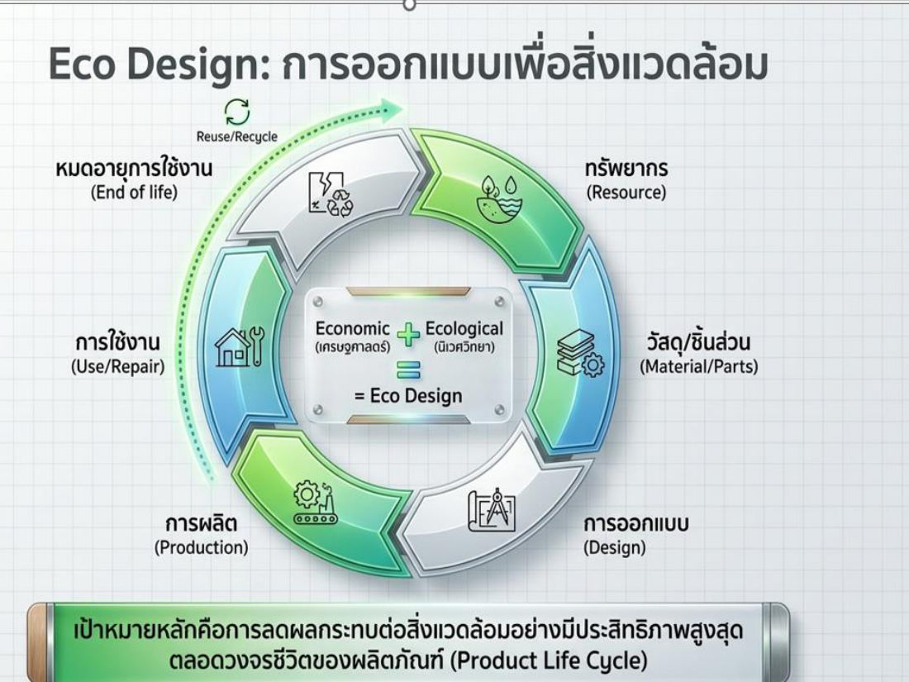

**ปรัชญา Eco Design (6 ข้อ)**
1. ใช้ทรัพยากรอย่างพอเพียง
2. ลดการใช้พลังงานที่ก่อให้เกิดมลภาวะ
3. เหมาะสมกับภูมิอากาศ
4. ใช้วัสดุที่เป็นพิษต่อสิ่งแวดล้อมแต่น้อย
5. ยังประโยชน์แต่ประหยัด
6. ส่งเสริมไลฟ์สไตล์ที่เป็นมิตรต่อสิ่งแวดล้อม

> ⚠️ "เน้นความหรูหรา ใช้พลังงานสูงสุด" = **ไม่ใช่**

**Eco Living (บ้านรักษ์โลก):** หลอดไฟ LED · แผงโซลาร์ผลิตไฟฟ้า · โครงสร้างที่ช่วยระบายอากาศ · ผลิตภัณฑ์ประหยัดน้ำ · เครื่องใช้ไฟฟ้าประหยัดพลังงาน · พื้นที่สีเขียว · วัสดุก่อสร้างที่ช่วยลดความร้อน
ตัวอย่างสไลด์: Green & Sustainable Architecture (ตึกปลูกต้นไม้ตามระเบียง, หลังคาสวน)

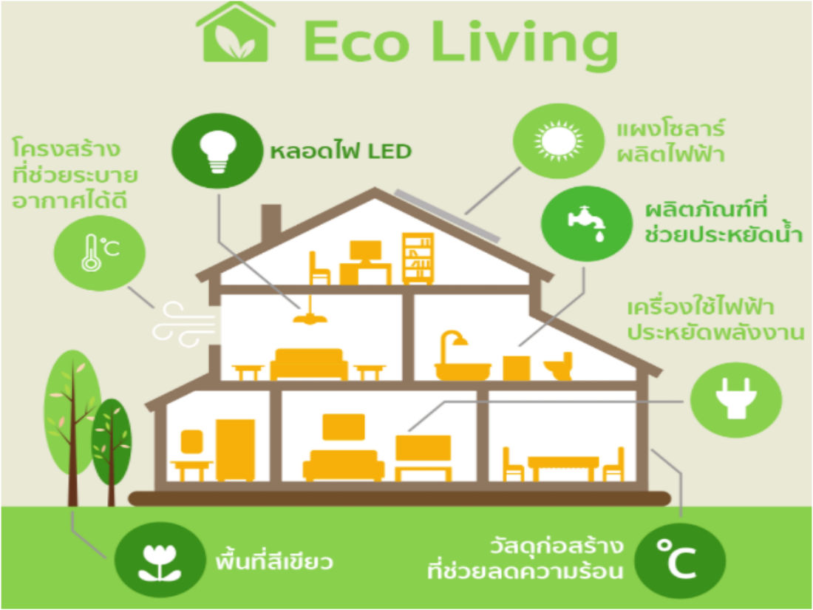

**หลัก 4R:** **Reduce** (ลดของเสีย) · **Reuse** (ใช้ซ้ำ) · **Recycle** (นำกลับมาใช้ใหม่) · **Repair** (ซ่อมบำรุง)
ภาพประกอบ: Reduce CO₂ · Reduce Energy · Reduce Water · Reduce Waste

> ⚠️ 4R **ไม่มี "Return"** หรือ "Refuse"

## 4. ปัจจัยภายนอกต่อการออกแบบอาคาร (กระทรวงพลังงาน) — 4 ข้อ

| ปัจจัย | แนวทาง |
|---|---|
| **1. ทิศทางแสงแดด** | ให้ **ด้านแคบ** ของอาคารหัน **ทิศตะวันออก–ตะวันตก** เพื่อให้ด้านที่มีพื้นที่ผนังน้อยรับความร้อน โดยเฉพาะช่วงบ่ายแดดจัด → ความร้อนเข้าอาคารลดลง ลดไฟฟ้าระบบปรับอากาศ |
| **2. พืชพันธุ์ธรรมชาติ** | ปลูกต้นไม้ใหญ่ทรงแผ่กว้าง พุ่มใบโปร่งรอบอาคาร ให้ร่มเงา · ปลูกไม้พุ่ม · สร้างบ่อน้ำเพิ่มความเย็น · ปลูกหญ้า/พืชคลุมดินกันความร้อนให้พื้นดิน |
| **3. สภาพภูมิประเทศ** | ปรับแต่งเนินดินรอบอาคารช่วยให้ลมเย็นพัดผ่านสะดวก · สร้างบ่อน้ำใหญ่ให้ลมพัดผ่านสร้างความเย็น |
| **4. สภาพภูมิอากาศ** | คำนึงถึงภูมิอากาศท้องถิ่น ใช้ลมประจำถิ่น วางแนวอาคาร/เปิดช่องรับลม — ไทย: **ลมฤดูร้อน** จากทิศใต้/ตะวันตกเฉียงใต้ · **ลมฤดูหนาว** จากทิศเหนือ/ตะวันออกเฉียงเหนือ |

## 5. การใช้เทคโนโลยีแก้ปัญหาสภาพแวดล้อมที่อยู่อาศัย

ภาพรวม: **1. ลมฟ้าอากาศ** (ระบายอากาศ · กระแสลม · ความกว้างช่องเปิด · ทิศทางลม) · **2. ความร้อน** (การถ่ายเทความร้อน · หลักป้องกันความร้อนจากดวงอาทิตย์ · วัสดุกันความร้อน) · **3. แสงสว่าง** (หน่วยวัดความส่องสว่าง · หลักการให้แสงสว่าง · การสะท้อนแสง · ชนิดหลอดไฟ)

### 5.1 ลมฟ้าอากาศ
- **1.1 การระบายอากาศ (Ventilation)** = **เปลี่ยนอากาศเก่าในห้องออกไป** ให้อากาศใหม่ที่สดชื่นกว่าเข้ามาแทน (ไล่กลิ่น อากาศร้อน ฝุ่น ความชื้น VOCs เรดอน)
- **1.2 กระแสลม (Air movement)** = เกิดจาก **ความแตกต่างของความกดอากาศ** หรือ **ความแตกต่างของอุณหภูมิ** — ลมพัดจาก **ความกดอากาศสูง/อุณหภูมิต่ำ → ความกดอากาศต่ำ/อุณหภูมิสูง**
- **1.3 ความกว้างของช่องเปิด** — นอกจากตำแหน่งช่องเปิด/หน้าต่าง **ความกว้าง** ก็มีผลต่อการกระจายของลมที่พัดผ่านห้อง (ช่องแคบ = ลมพุ่งเป็นลำแคบ · ช่องกว้าง = ลมกระจายทั่วห้อง)
- **1.4 ทิศทางลม** — บังคับลมให้ผ่านอาคารตามต้องการได้ยาก แต่ **ชนิดและตำแหน่งหน้าต่าง** ช่วยบังคับได้ รวมถึง **ชายคา (Awnings)** และ **แผงกั้นลม (Barriers)** เปลี่ยนทิศลม

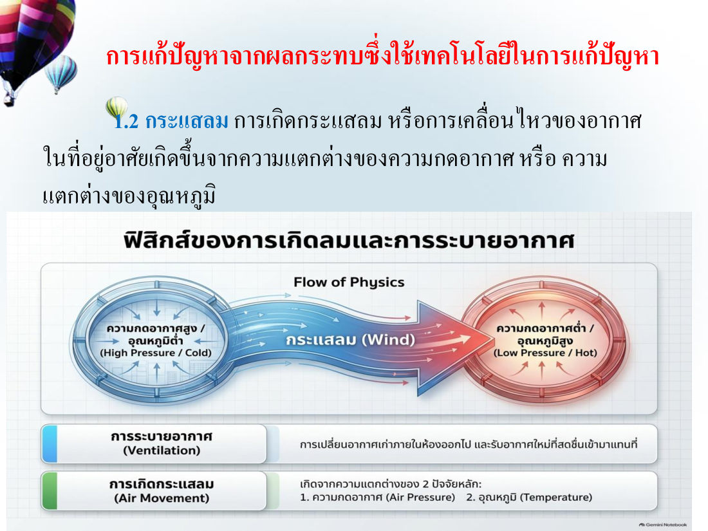

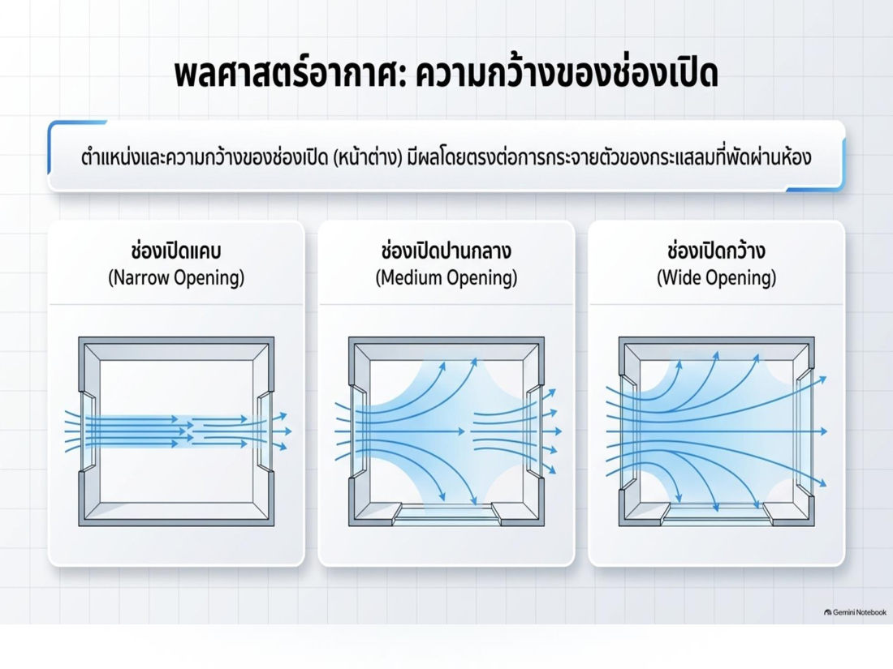

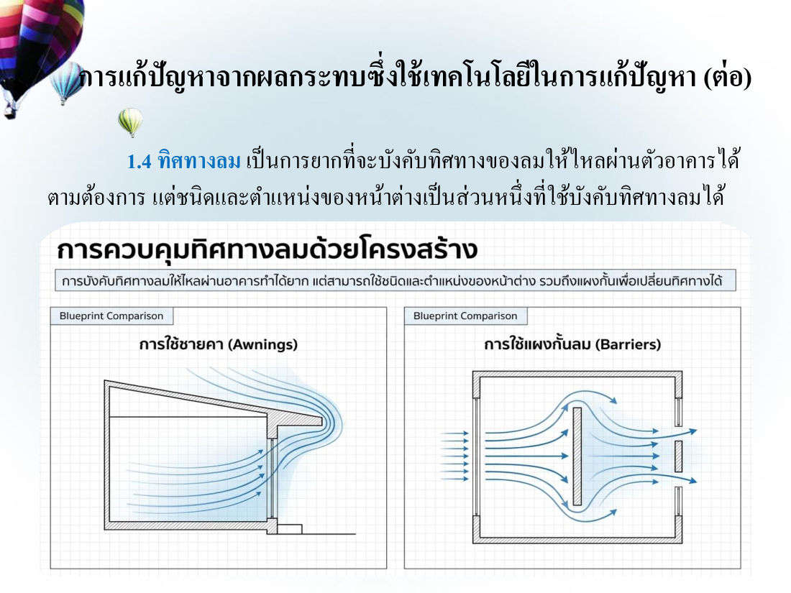

> 💡 (เสริม — ข้อสอบฝึกข้อ 58) อาคารในที่ร้อนชื้นระบายความร้อนดีที่สุดเมื่อมี **ช่องเปิดเพียงพอ วางให้ลมพัดผ่านตลอด (cross ventilation)** ร่วมกับวัสดุนำความร้อนต่ำ — ไม่ใช่อาคารปิดทึบ

### 5.2 ความร้อน — การถ่ายเทความร้อน 3 แบบ ⭐

| แบบ | เกิดอย่างไร | ปัจจัยที่มีผล / ตัวอย่าง |
|---|---|---|
| **การนำความร้อน (Conduction)** | ความร้อนไหลผ่านจากวัตถุหนึ่งไปอีกวัตถุที่ **สัมผัสกัน** | สมบัติการนำความร้อนของสสาร ความหนาแน่น ความชื้นในสสาร ความต่างของระดับความร้อน · เช่น ด้ามหม้อร้อน, ความร้อนผ่านหลังคา/พื้น |
| **การพาความร้อน (Convection)** | เกิดใน **ของเหลวหรือก๊าซ** ที่ความหนาแน่นต่างกันเมื่อร้อนต่างกัน → เกิด **การเคลื่อนไหว** แล้วพาความร้อนไป | Natural convection (ลอยขึ้นเอง) / Forced convection (ใช้พัดลม) · เช่น น้ำเดือดหมุนวนในหม้อ |
| **การแผ่รังสีความร้อน (Radiation)** | ความร้อนแผ่ออกจากวัตถุ เดินทางผ่านอากาศ **ในลักษณะคลื่น** (ไม่ต้องสัมผัส) | ความถี่คลื่นขึ้นกับอุณหภูมิวัตถุ · สสารทุกชนิดแผ่รังสีได้ มากน้อยขึ้นกับ **อุณหภูมิ** และ **ธรรมชาติของผิววัตถุ** · เช่น แดดส่อง, ไอร้อนจากกองไฟ |

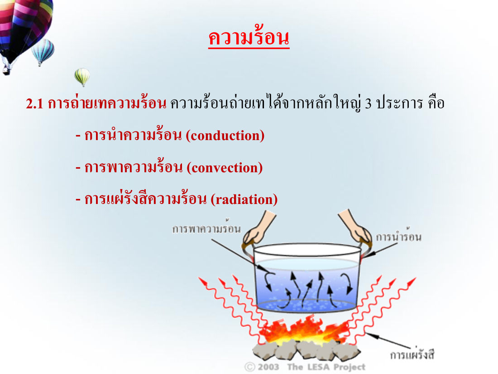

> 💡 จำ: **นำ = แตะ** · **พา = ไหล (ของเหลว/ก๊าซ)** · **แผ่ = คลื่น ไม่ต้องมีตัวกลาง**

**แหล่งความร้อนที่เกิดขึ้นในอาคาร:** การนำความร้อนจากหลังคา · การแผ่รังสีจากดวงอาทิตย์ · อุปกรณ์ในอาคาร · อากาศภายนอก · ผนังอาคาร · การนำความร้อนจากพื้น · ความร้อนจากผู้ใช้อาคาร

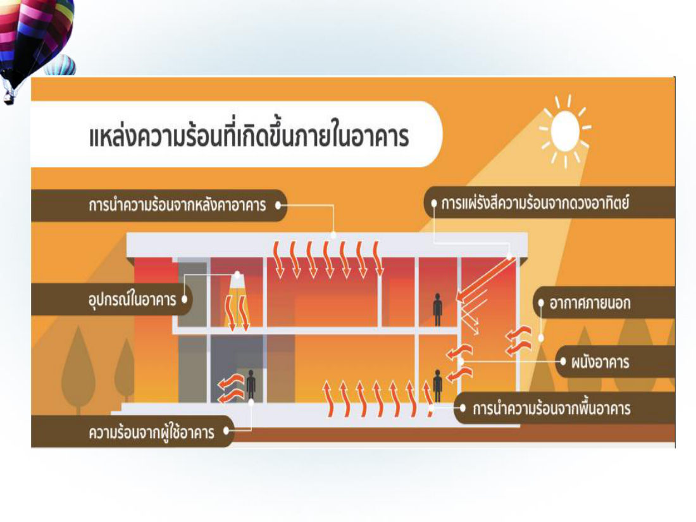

### 5.3 วัสดุกันความร้อน (insulation) ⭐
วัสดุที่ **นำความร้อนต่ำ** **ความหนาแน่นน้อย** เป็นฉนวนและตัวดักความร้อนก่อนเข้าอาคาร ให้ความร้อนผ่านโดยการนำได้ช้าลง แบ่ง **3 ประเภท**:
1. **ชนิดแผ่นแท่งก้อน (rigid insulation)**
2. **ชนิดแผ่นยืดหยุ่นได้ (flexible / blanket types)**
3. **ชนิดใช้ฉาบเสริม (insulating fills)**

## 6. ปัจจัยภายในต่อการออกแบบอาคาร — 6 ข้อ

| ปัจจัย | แนวทาง |
|---|---|
| **1. ผนังทึบ** | สำคัญต่อการประหยัดพลังงาน (พลังงานส่วนใหญ่ใช้กับแอร์) · เพิ่ม **R-value** (ความต้านทานความร้อน) ด้วยฉนวนที่ผนังด้านนอก หรือ **ผนัง 2 ชั้นมีช่องว่างอากาศ** · สีผนังภายนอกควร **โทนอ่อน** (ขาว ครีม) ดูดกลืนรังสีน้อยกว่าโทนเข้ม ถ้าใช้สีเข้มควรทาด้านที่โดนแดดน้อย หรือติดฉนวนเพิ่ม |
| **2. ผนังโปร่งแสง (กระจก)** | รับและถ่ายเทความร้อนจากแดดเข้าอาคาร **มากกว่าผนังทึบ 5–10 เท่า** → เลือกชนิดกระจกและวิธีติดตั้งให้ดี |
| **3. หลังคา** | ติดฉนวนกันความร้อน เช่น **ฉนวนใยแก้ว, ฉนวน PU, แผ่นยิปซัมบอร์ด, แผ่นอลูมิเนียมฟอยล์** |
| **4. อุปกรณ์บังแดดภายนอก** | ลดความร้อนได้ **ดีกว่าแบบภายใน** · ติดตั้งโดยคำนึงถึงทิศอาคาร ขนาดช่องเปิด ช่องว่างกับผนัง · **ทิศใต้/เหนือ → แนวนอน** · **ทิศตะวันออก/ตะวันตก → แนวตั้ง** |
| **5. ระบบปรับอากาศ** | เลือกขนาดทำความเย็นเหมาะกับภาระ ประสิทธิภาพสูง เช่น **ฉลากประหยัดไฟเบอร์ 5** |
| **6. ระบบไฟฟ้าแสงสว่าง** | ใช้ไฟน้อยที่สุดแต่สว่างพอ · หลอดประสิทธิภาพสูง/**LED** · ใช้แสงธรรมชาติกลางวัน แยกสวิตช์โซนริมหน้าต่าง |

**คุณสมบัติของกระจกที่เหมาะสม**

| ค่า | ความหมาย | ควรเป็น |
|---|---|---|
| **VT** (Visible Transmittance) | ค่าการส่องผ่านของแสง | **ไม่น้อยกว่า 20%** เพื่อใช้แสงธรรมชาติ |
| **U-value** | สัมประสิทธิ์การถ่ายเทความร้อนรวม | **น้อย** (เช่น กระจกเขียวตัดแสง, สะท้อนแสง, Low-E) |
| **SHGC** (Solar Heat Gain Coefficient) | สัมประสิทธิ์การส่งผ่านความร้อนจากรังสีอาทิตย์ผ่านกระจก | **น้อย** กันรังสีอาทิตย์และสบายตา |

ตัวเลขในสไลด์: กระจกใส U 1.25 / VT 0.74 / SHGC 0.76 · กระจกเขียวตัดแสง U 0.49 / VT 0.44 / SHGC 0.46 · **Low-E U 0.32 / VT 0.50 / SHGC 0.30** (ดีสุด)

**หลอดไฟ (650 lumen เท่ากัน):** หลอดไส้ 60W อายุ 1,000 ชม. · หลอด CFL 13W 8,000 ชม. ประหยัด 78% · **หลอด LED 8W 15,000 ชม. ประหยัด 86%**

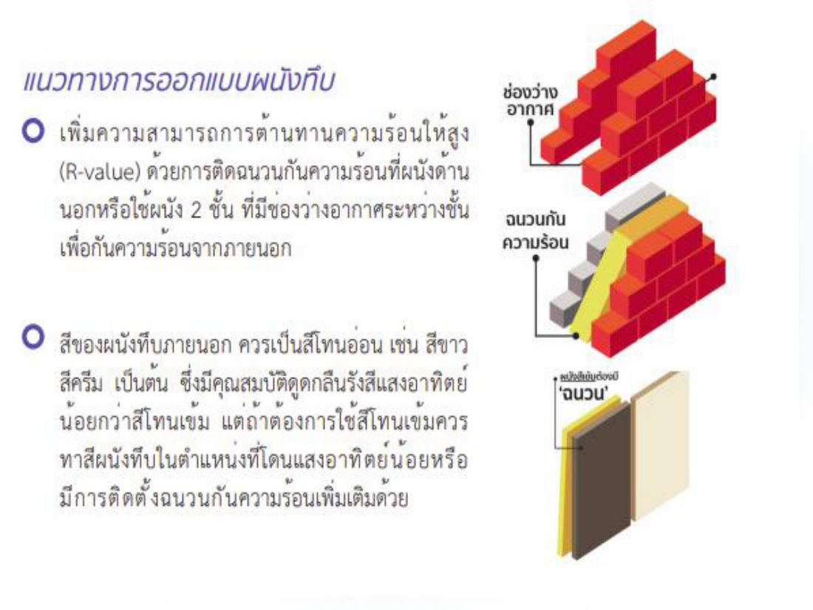

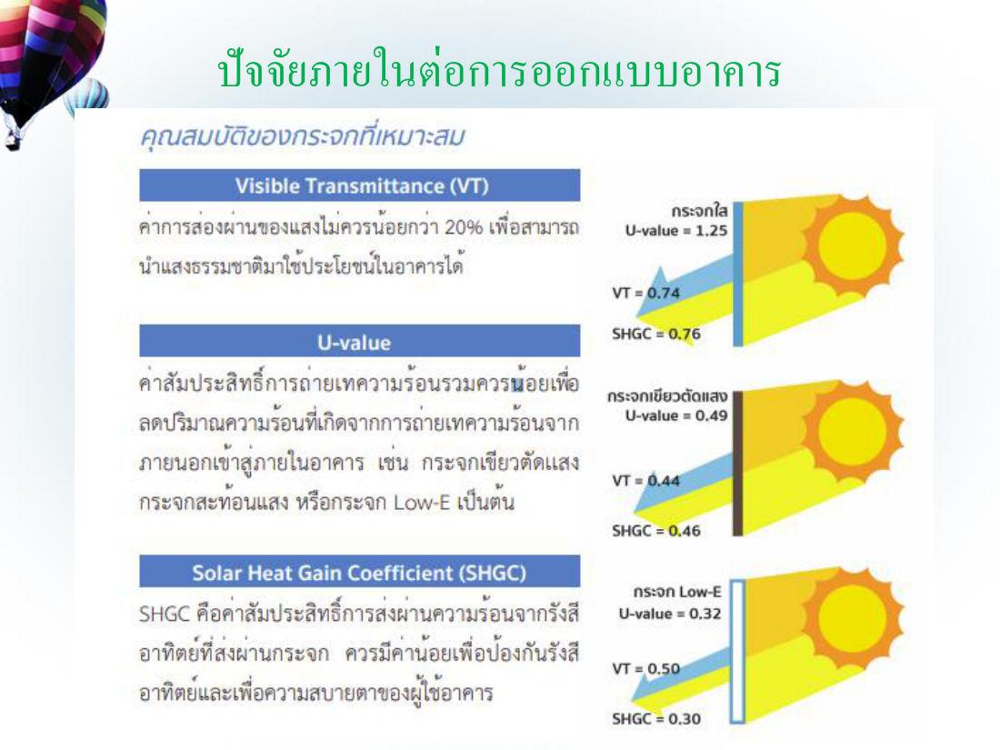

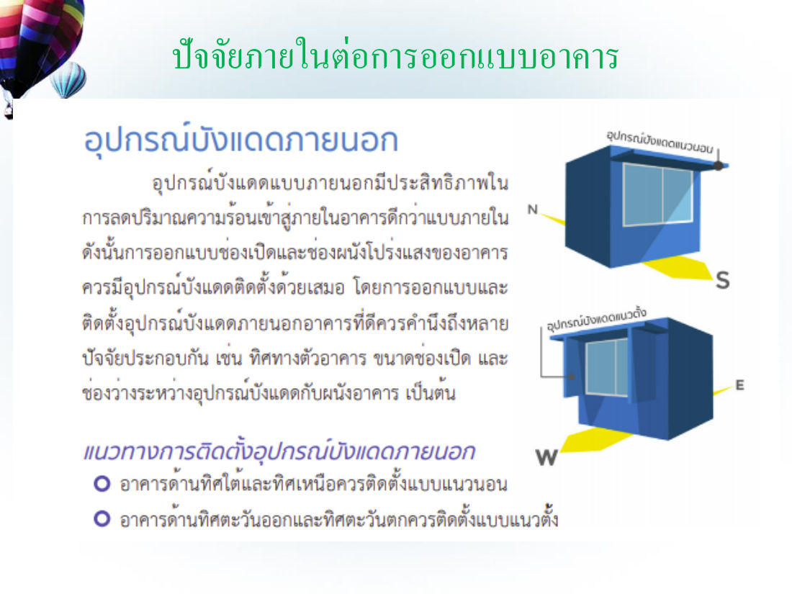

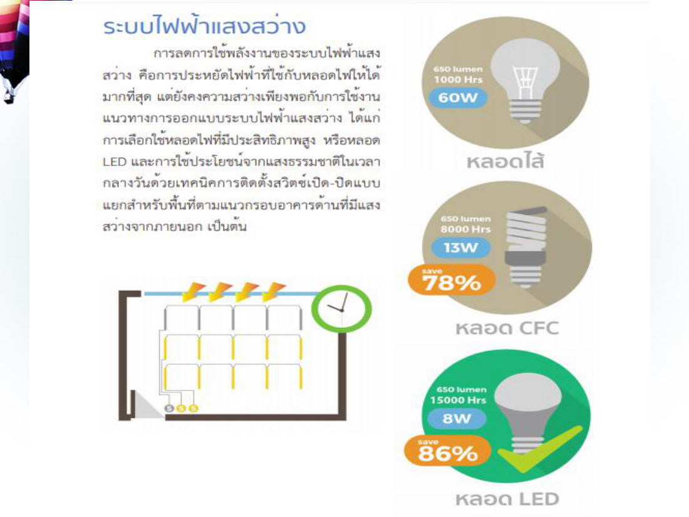

> (เสริม — ข้อสอบฝึกข้อ 64–65 ไม่มีในสไลด์) ประเทศไทยอยู่ซีกโลกเหนือ แผงโซลาร์ควรหัน **ทิศใต้** · บ้านระบายอากาศไม่ดีเสี่ยง **โรคทางเดินหายใจและภูมิแพ้**

## 7. วิทยาศาสตร์กับวัสดุก่อสร้าง

วิทยาศาสตร์เกี่ยวข้อง 2 ประเด็น: **(1) ปรับปรุง/เปลี่ยนแปลงสมบัติทรัพยากรธรรมชาติ** ให้เป็นวัสดุก่อสร้างที่ดีขึ้น **(2) สังเคราะห์สารทดแทน** ทรัพยากรธรรมชาติ

### 7.1 ปูนซีเมนต์
- ผสมน้ำ → เปลี่ยนแปลงทางเคมี = **ปฏิกิริยาไฮเดรชั่น (hydration)** → ยึดอนุภาคของแข็งให้รวมกัน
- ปูน + หินกรวด + ทราย + น้ำ ในอัตราส่วนเหมาะสม = **คอนกรีต** แข็งตัวแล้วทนทานคล้ายหิน
- **ปัญหาโลกแตก:** ด้านบวก — ปูนให้ความแข็งแรง ปลอดภัย บ้านมั่นคง · ด้านลบ — การเผาแบบเดิมปล่อย **CO₂ มหาศาล** สิ้นเปลืองพลังงาน · **ทางออก:** ลดผลกระทบตลอดวงจรชีวิตผลิตภัณฑ์ (Eco Design)

**นวัตกรรมปูนซีเมนต์ 5 อย่าง ("The Green Blueprint")**

| นวัตกรรม | สาระสำคัญ |
|---|---|
| **1. ปรับสูตรปูน (Recipe)** | ปูนแบบดั้งเดิม (Portland) ใช้หินปูนมาก เผาร้อนจัด ปล่อยคาร์บอนสูง → **ปูนรักษ์โลก (Geopolymer & Low-CO₂)** ใช้วัสดุทดแทน เช่น **เถ้าลอย (Fly Ash), ตะกรัน (Slag)** ไม่ต้องเผาร้อนสูง **ลด CO₂ ได้สูงสุด 80%** (ปูนไฮบริด/คาร์บอนต่ำ ลด CO₂ 0.05 ตัน/ปูน 1 ตัน) |
| **2. วงจรชีวิตระบบปิด (Circular Economy)** | จาก "ผู้สร้างขยะ" เป็น "ผู้กำจัดขยะ" ผ่าน 4R · **เชื้อเพลิงทางเลือก** (ชีวมวล ขยะอุตสาหกรรม แทนฟอสซิล) · **วัสดุเสริม (SCMs)** นำของเสียอุตสาหกรรมผสมคอนกรีต |
| **3. พิมพ์ 3 มิติ (3D Printing Concrete)** | ไร้ขีดจำกัดรูปทรง ไม่ต้องใช้แบบ · รวดเร็ว แม่นยำ (คอมพิวเตอร์คุม ลดแรงงาน) · **ขยะเป็นศูนย์** |
| **4. คอนกรีตมีสมองและยืดหยุ่น (Smart & Flexible)** | โค้งงอได้เล็กน้อย ต้านแผ่นดินไหว ลดแตกร้าว · ฝังเซนเซอร์ **IoT** วัดอุณหภูมิ/ความชื้น real-time + **AI** ปรับสูตรบ่มปูน |
| **5. ดูดซับคาร์บอน (Absorb)** | **CCS (Carbon Capture and Storage)** ดักจับ CO₂ จากเตาเผา · **Carbon-Negative Cement** ดูดซับ CO₂ จากอากาศเก็บไว้ในโครงสร้างขณะแข็งตัว (ตึกเป็น "ต้นไม้สังเคราะห์") |

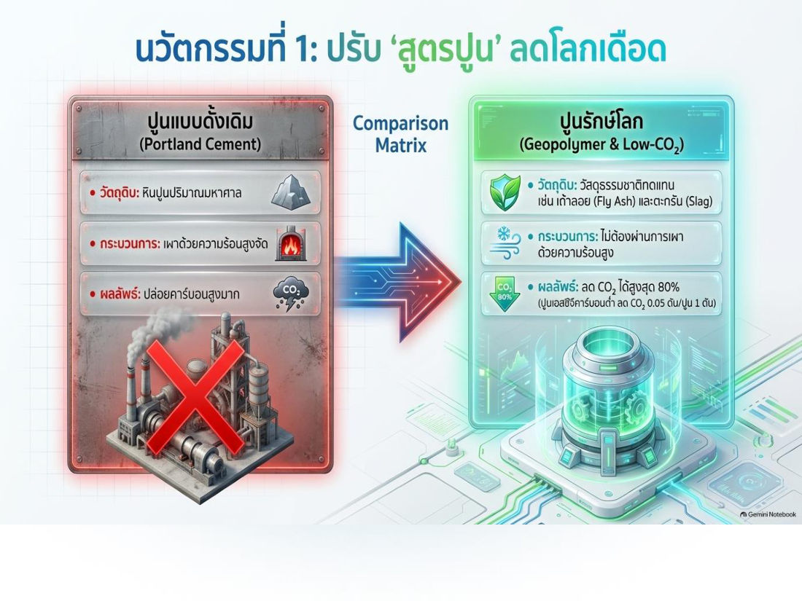

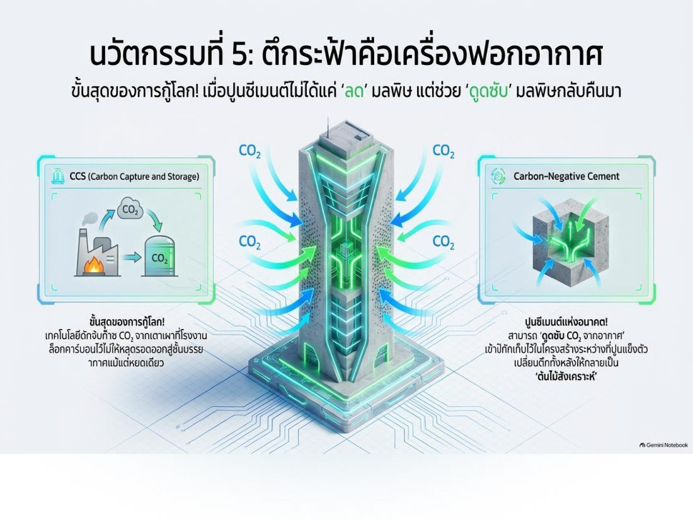

### 7.2 อิฐ (brick)
- ทำจาก **ทราย + ดินเหนียว** หรือ **ทราย + หินแข็ง** · สมบัติขึ้นกับสัดส่วน/ชนิดวัสดุ วิธีผลิต เวลาและอุณหภูมิเผา
- **เผาอุณหภูมิสูงขึ้น → สีคล้ำขึ้น ความพรุนลดลง ความแข็งแรงเพิ่มขึ้น** ⭐
- ชนิด: อิฐมอญ/อิฐดินเผา · อิฐขาว · อิฐประดับ · อิฐบล็อกและคอนกรีตบล็อก · อิฐทนไฟ

### 7.3 ไม้และไม้อัด / WPC
- ไม้ = อินทรีย์วัตถุธรรมชาติ สารสำคัญ 2 ชนิด: **เซลลูโลส** (ผนังเสี้ยนไม้ ~ **60%**) และ **ลิกนิน** ⭐
- โครงสร้างไม้อายุใช้งานประมาณ **20–30 ปี** ถ้าใช้เหมาะสมจะยืนยาว วิทยาศาสตร์ช่วยปรับสมบัติไม้ได้
- **ปัญหาไม้จริง:** สวยคลาสสิก แต่แลกกับปลวก ความชื้น ค่าบำรุงรักษา
- **WPC (Wood Plastic Composite / ไม้เทียม)** = **ผงไม้ธรรมชาติ + พลาสติกโพลิเมอร์ + ความร้อน/การอัดรีด** → ผสานจุดแข็ง (สวยแบบไม้ + ทนแบบพลาสติก) · ไร้รอยต่อ แข็งแรง · รักษ์โลก (พลาสติกรีไซเคิล ลดตัดไม้)

| Pain point | ไม้ธรรมชาติ | ไม้เทียม WPC |
|---|---|---|
| น้ำ/ความชื้น | บวม โก่ง ผุพังง่าย | ทนชื้น ไม่บวมน้ำ 100% |
| ปลวก/แมลง | อาหารชั้นดีของปลวก | ปลอดภัย 100% (Anti-Termite) |
| ไฟ | เชื้อเพลิงชั้นดี ลามเร็ว | Fire Retardant (ชะลอการลามไฟ) |
| บำรุงรักษา | ขัด/ทาสีตลอดอายุ | ลงทุนครั้งเดียว ไม่ต้องทาสีใหม่ |

**วิวัฒนาการไม้เทียม:** Gen 1 **WPC + PE** (หนัก แข็งแรง แต่ดูดความชื้น เสื่อมตามอากาศ) → Gen 2 **WPC + PVC** (เบามาก เหมาะผนัง/ฝ้า แต่ทน UV ไม่ดี กรอบแตกเมื่ออยู่กลางแจ้ง) → Gen 3/4 **Co-Extrusion** (เคลือบโพลิเมอร์ HDPE/ASA เป็น "เกราะ" รอบแกนกลาง ทนแดด ทนฝน สีไม่ซีด อายุ 10–50 ปี)
**Co-Extrusion:** เกราะป้องกันผิว (Durashield — เคลือบ 360° กัน UV สีไม่ซีด กันน้ำ 100% ทนเคมี กันรอยขีดข่วน) + แกนกลาง (PE เน้นรับน้ำหนัก / PVC เน้นเบา / Aluminium อายุ 50 ปี)

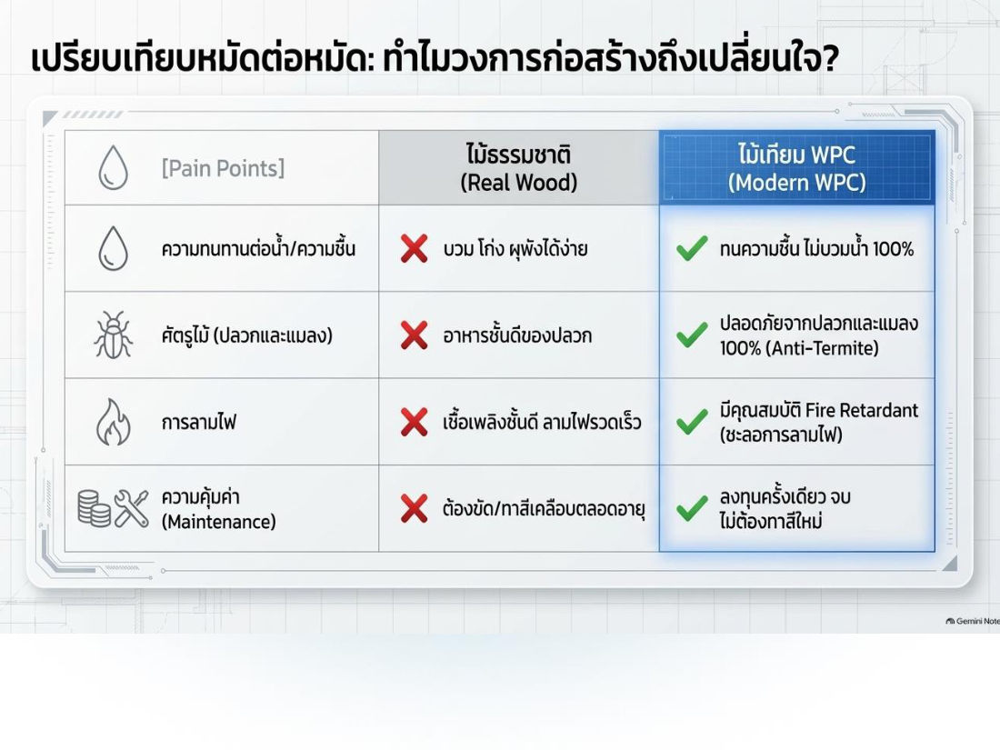

### 7.4 เหล็ก
| ข้อดี | ข้อเสีย |
|---|---|
| **กำลังสูง** คุณสมบัติสม่ำเสมอ **ยืดหยุ่นสูง** คงทนถาวร มีความอ่อนตัว **ใช้เวลาก่อสร้างน้อย** | **ราคาแพง** ค่าบำรุงรักษาสูง **กำลังตกเมื่อโดนความร้อนสูง** โก่งงอได้ง่าย |

**การป้องกันสนิม 3 วิธี**
1. **เคลือบผิว** — พ่นโฟมกันสนิม ทาสี/พ่นสีกันสนิม
2. **ทำเหล็กกล้าไร้สนิม** — เกิดฟิล์มบางบนผิว เช่น **นิกเกิล (Ni), โครเมียม (Cr)**
3. **ใช้กระแสไฟฟ้า** — ทำให้เหล็กมีศักย์ไฟฟ้าสูงกว่าบริเวณรอบ ๆ

## 8. วิทยาศาสตร์เพื่อสังเคราะห์สารทดแทนทรัพยากรธรรมชาติ

เหตุผล: ประชากรเพิ่ม ทรัพยากรลดลง และทรัพยากรเกิดใหม่ใช้เวลานาน → สังเคราะห์สารใหม่ทดแทน

- **8.1 กระเบื้องยาง** — **โค้งดัดได้โดยไม่แตก** เพราะยืดหยุ่นดี ใช้ในที่ที่มีไขมันได้ (ทนคราบสกปรก)
- **8.2 สี** — ทาเพื่อ **รักษาเนื้อไม้/วัสดุให้คงทนถาวร** (และความงาม) สีทาอาคารสังเคราะห์เป็นฟิล์มเคมีป้องกันรังสี UV สภาพอากาศ การผุพัง
- **8.3 พลาสติก** — ได้จากกระบวนการทางวิทยาศาสตร์ **คงทนถาวร ป้องกันแมลงและสัตว์** ได้

**ท่อพลาสติก 5 ชนิด** ⭐

| ท่อ | ชื่อเต็ม | ใช้กับ |
|---|---|---|
| **ABS** | Acrylonitrile-Butadiene-Styrene | ท่อระบายน้ำเสีย ท่ออากาศ |
| **PVC** | Polyvinyl Chloride | ต้านแรงดัน แรงกระแทก รับแรงดึงสูง → **ท่อน้ำจ่ายเข้าอาคาร** ระบายน้ำ ชลประทาน ส่งแก๊สธรรมชาติ |
| **CPVC** | Chlorinated Polyvinyl Chloride | **ต้านความร้อนและแรงดันได้มากกว่าปกติ → ท่อน้ำร้อน** ท่อสารเคมี |
| **SR** | Styrene-Rubber | ท่อในถังบ่อเกรอะ ระบายน้ำเสีย/น้ำฝน ท่อโสโครก **ใต้ดิน** |
| **PO** | Polyolefin | ท่อน้ำเสีย เพราะ **ต้านการสึกกร่อนดี** |

> 💡 CPVC = PVC ที่เติม **C**hlorine จนทนร้อนกว่า → **น้ำร้อน** · SR = ใต้ดิน · PVC = น้ำประปาเข้าบ้าน

---

## คำศัพท์สำคัญ

| คำศัพท์ | ความหมาย | จำง่าย ๆ ว่า |
|---|---|---|
| Eco Design | Economic + Ecological ลดผลกระทบตลอดวงจรชีวิต | เศรษฐ + นิเวศ |
| Product Life Cycle | วงจรชีวิตผลิตภัณฑ์ ตั้งแต่ทรัพยากรถึงหมดอายุ | เกิด–ตาย ของสินค้า |
| 4R | Reduce Reuse Recycle Repair | ไม่มี Return |
| Ventilation | เปลี่ยนอากาศเก่าออก อากาศใหม่เข้า | |
| Conduction / Convection / Radiation | นำ / พา / แผ่รังสี | แตะ / ไหล / คลื่น |
| Insulation | วัสดุกันความร้อน นำความร้อนต่ำ | rigid / blanket / fills |
| R-value / U-value | ความต้านทานความร้อน (สูงดี) / การถ่ายเทความร้อน (ต่ำดี) | R ต้าน, U ผ่าน |
| SHGC / VT | ความร้อนจากแดดผ่านกระจก / แสงผ่านกระจก | SHGC น้อยดี, VT ≥ 20% |
| Hydration | ปฏิกิริยาปูน + น้ำ | ปูนแข็งตัว |
| Geopolymer | ปูนคาร์บอนต่ำ ใช้เถ้าลอย/ตะกรัน | ลด CO₂ 80% |
| WPC | Wood Plastic Composite ไม้เทียม | ผงไม้ + พลาสติก |
| CPVC | ท่อทนร้อน | น้ำร้อน |

## สรุปท้ายบท / จุดที่มักออกสอบ

- ที่อยู่อาศัย = ปัจจัย 4 + 1 ใน 9 ตัวชี้วัดคุณภาพชีวิต UN 1990
- **Eco Design = เศรษฐศาสตร์ + นิเวศวิทยา** ตลอด Product Life Cycle · ปรัชญา 6 ข้อ · **4R = Reduce Reuse Recycle Repair**
- ปัจจัยภายนอก 4: ทิศแสงแดด (ด้านแคบหัน ต.อ.–ต.ต.) · พืชพันธุ์ · ภูมิประเทศ · ภูมิอากาศ
- ปัจจัยภายใน 6: ผนังทึบ · ผนังโปร่งแสง (ร้อนกว่า 5–10 เท่า) · หลังคา · บังแดดภายนอก (ใต้/เหนือ=แนวนอน, ออก/ตก=แนวตั้ง) · แอร์เบอร์ 5 · แสงสว่าง/LED
- กระแสลม = ความต่างความกดอากาศหรืออุณหภูมิ
- **นำ = สัมผัส · พา = ของเหลว/ก๊าซ ความหนาแน่นต่าง · แผ่รังสี = คลื่น ไม่ต้องสัมผัส**
- ฉนวน 3 ชนิด: แผ่นแท่งก้อน / แผ่นยืดหยุ่น / ฉาบเสริม
- ปูน + น้ำ = **ไฮเดรชั่น** · อิฐเผาร้อนขึ้น = **คล้ำ พรุนลด แข็งแรงขึ้น** · ไม้ = **เซลลูโลส + ลิกนิน**
- เหล็ก ข้อดี = กำลังสูง ยืดหยุ่นสูง สร้างเร็ว · ข้อเสีย = แพง บำรุงรักษาสูง กำลังตกเมื่อร้อน
- **CPVC = ท่อน้ำร้อน** · PVC = น้ำประปา · ABS = น้ำเสีย/อากาศ · SR = ใต้ดิน · PO = น้ำเสีย กันกร่อน
